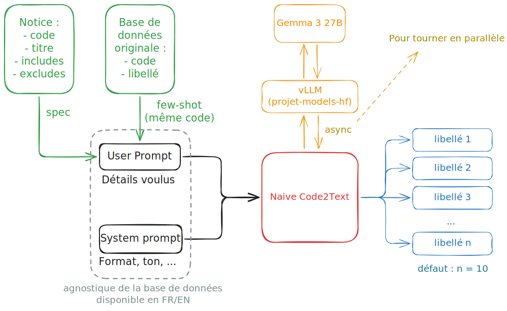
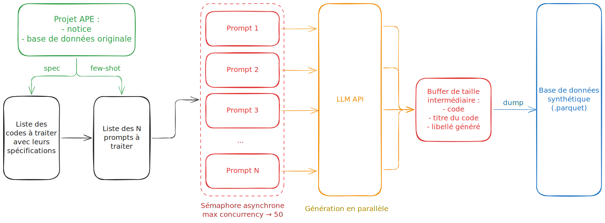
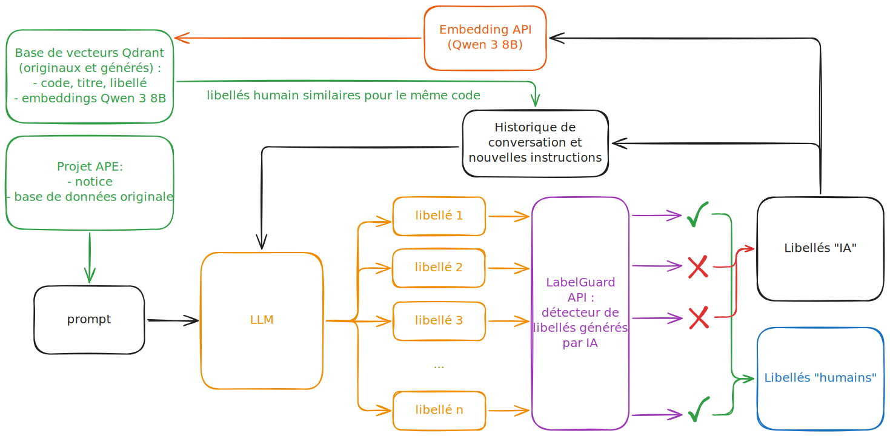
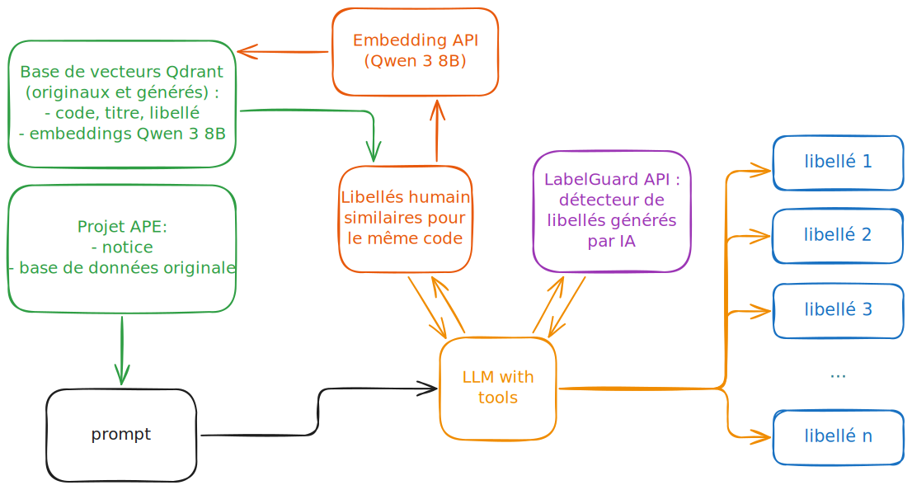
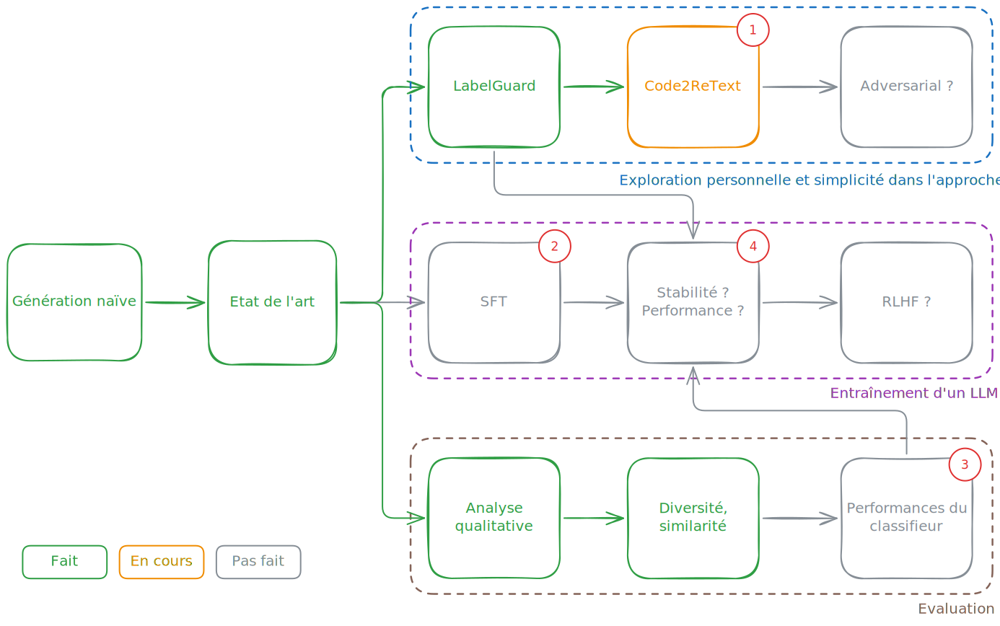

```{=html}
<span class="report-kicker">Rapport de stage</span>
```

**Tuteur de stage :** Meilame Tayebjee, SSP Lab (Insee)


# Préambule {#sec-preambule .unnumbered}

Mon stage s'est déroulé à l'Institut National de la Statistique et des Etudes Economiques (Insee), et plus précisément au sein de son laboratoire d'innovation : le SSP Lab. Très centré autour du Natural Language Processing (NLP), j'ai été amené à travailler sur la génération de données synthétiques textuelles. Ce rapport présente ma démarche, les difficultés rencontrées ainsi que les résultats que j'ai obtenus. Il se termine par un regard critique sur les contributions apportées et sur les perspectives envisagées.

# Executive summary {#sec-summary .unnumbered}


# Contexte {#sec-contexte}

## Les enjeux de la codification {#sec-intro-codif}

Être capable de catégoriser les éléments dans une nomenclature est très important pour les services statistiques publiques. D'un côté, le débat public a besoin d'être alimenté de chiffres fiables et précis, ce qui se traduit par le maillage fin d'une nomenclature. Prenez l'indice des prix à la consommation (IPC), métrique phare pour évaluer l'inflation : si une nomenclature pour les produits de consommation comme la COICOP [@inseecoicop] n'existait pas, il serait difficile d'évaluer les paniers des ménages lors de leurs achats, et donc difficile d'accorder les poids aux bons éléments dans l'indice. De l'autre, les législations imposent parfois des nomenclatures à respecter. Par exemple, chaque pays de l'Union Européenne doit rendre compte des activités économiques de leurs entreprises en respectant la Nomenclature statistique des Activités économiques dans la Communauté Européenne (NACE) [@statbelnace].

Cependant, mettre en place un système de codification demande beaucoup de ressources. Déjà, il faut parvenir à converger vers un standard général et concevoir une notice exhaustive. Puis, il faut subvenir aux besoins pratiques lors de l'application de la nomenclature. De ce fait, la donnée qui doit être classée arrive avec un grand débit et demande de choisir parmi un grand nombre de catégories. Pour le cas de la NACE, on compte ainsi chaque année plus d'un millions de nouvelles entreprises à associer à un code parmi les plus de 600 existants (plus de 700 pour la nomenclature française). Il faut donc une très grande efficacité ainsi qu'une expertise de la notice de codification.

Historiquement, la codification a été assurée par des annotateurs humains, qui sont souvent des supports techniques dans la création de dossiers administratifs à qui on rajoute la tâche de codification. Cela permet d'éviter de donner la charge à la personne qui fait la demande et qui n'est pas forcément au point sur la nomenclature --- qui pourrait donc faire des erreurs ---, en lui imposant à la place de remplir un libellé textuel qui décrit l'élément à codifier. Pour illustrer, prenons l'exemple de la Nomenclature d'Activité Française (NAF), la version française de la NACE. Le futur chef d'entreprise français qui fait sa demande de SIRET indique dans un champ textuel l'activité économique principale de son entreprise expliquée avec ses propres mots. Puis, son dossier est envoyé auprès de l'administration qui reçoit des éléments comme la raison sociale de l'entreprise, son siège social, ... ainsi que le libellé décrivant l'activité. Alors, durant l'étude du dossier, un des membres de l'administration va associer un code NAF, qui sera également retransmis services statistiques publics comme l'Insee.

Cette manière de procéder à ses limites. Notamment, cela coûte cher d'employer des personnes à faire la même tâche répétitive pour l'ensemble des éléments à classer, car ceux-ci peuvent se tromper en faisant des fautes de frappes ou en oubliant une partie de la notice --- surtout pour les cas rares. L'Insee a donc mis en place un système de codification automatique basé sur la donnée textuelle --- et potentiellement d'autres données auxilières numériques ou catégorielles --- pour aider les annotateurs. On nommera cette tâche automatisée Text2Code (*text to code*).


## Text2Code : codifier automatiquement des libellés dans une nomenclature {#sec-text2code}

L'objectif initial de ce stage s'inscrit dans la problématique de la codification automatique (Text2Code) : associer automatiquement un libellé textuel à un code dans une nomenclature donnée. Ces nomenclatures, comme la NAF/NACE ou la COICOP, peuvent être très vastes et comporter plusieurs centaines de codes distincts, ce qui rend la tâche de classification particulièrement exigeante.

Pour chaque nomenclature, on dispose d'une **notice associée**, qui constitue une ressource documentaire exhaustive. Celle-ci contient typiquement quatre champs structurés : le code, le titre, les inclusions (*includes*) et les exclusions (*excludes*). Dans certains cas, on dispose également de paires libellé/code issues de données réelles, qui servent de données d'entraînement pour les classifieurs.

Malgré la disponibilité de ces ressources, la construction d'un classifieur robuste se heurte à plusieurs **difficultés majeures**. En premier lieu, les données d'entraînement souffrent fréquemment d'un défaut de couverture : certains codes sont peu ou pas représentés, ce qui crée des zones d'ombre pour le modèle. À cela s'ajoute le risque lié à l'actualisation possible de la nomenclature, qui peut invalider des données d'entraînement pourtant laborieusement constituées.

Les données réelles introduisent également du **bruit sémantique** — fautes d'orthographe, informations personnelles, abréviations, typographies fantaisistes — ainsi que du **bruit d'annotation**, lorsqu'un code incorrect a été associé à un libellé lors de la constitution du jeu de données. Enfin, dans certaines situations, la donnée est simplement insuffisante : lorsqu'on travaille sur une nomenclature nouvelle ou qu'on doit basculer vers une langue différente, les données existantes ne sont plus exploitables telles quelles.

::: {.callout-important}
Sans génération de données synthétiques, la codification automatique peut être imprécise, voire totalement impossible dans les cas extrêmes. C'est ce constat qui motive l'ensemble du travail présenté ici.
:::

# La génération de données synthétiques {#sec-generation}

## Un contexte particulier {#sec-contexte-gen}

Les approches classiques de génération de données synthétiques s'appuient exclusivement sur la donnée d'entrée. Sans recours aux grands modèles de langage, on cherche à reproduire une distribution statistique en y appliquant des règles de transformation, des perturbations contrôlées ou des techniques d'augmentation. Avec des LLMs, on peut aller plus loin en fournissant du contexte et des exemples en mode few-shot. Dans les deux cas, cependant, la donnée générée reste étroitement liée à la donnée d'origine et n'apporte pas d'information véritablement nouvelle.

Notre contexte est particulier pour une raison décisive : nous disposons d'une **notice** pour chaque nomenclature. Cette notice constitue une information supplémentaire exhaustive, indépendante des données d'entraînement, et particulièrement bien adaptée à l'alimentation des LLMs en contexte. Elle permet d'envisager une génération de libellés qui s'affranchit partiellement des biais de la donnée réelle.

## Objectifs recherchés {#sec-objectifs}

La génération de données synthétiques poursuit plusieurs objectifs complémentaires. L'objectif premier est d'**augmenter, diversifier ou créer de toutes pièces** la donnée d'entraînement des classifieurs, notamment pour les codes sous-représentés. Un second objectif consiste à permettre le **partage de données** sans risque de fuite du jeu de données original, tout en conservant une représentation fidèle de son format, de sa distribution et de la sémantique des libellés. Enfin, les scripts de génération doivent être conçus de façon **agnostique** par rapport à la nomenclature, pour être réutilisables sans adaptation majeure.

Il convient cependant de noter que ces objectifs ne convergent pas nécessairement vers un outil unique. Améliorer les performances d'un classifieur par la donnée ne revient pas toujours à reproduire fidèlement la distribution originale ; dans certains cas, cela implique au contraire de s'en éloigner pour couvrir des zones mal représentées. Ce faisant, on prend le risque de s'approcher de données bruitées qui nuiraient à la qualité du classifieur.

## Évaluation de la génération {#sec-evaluation}

L'évaluation d'un générateur de libellés synthétiques repose sur trois axes principaux. Le premier est directement applicatif : mesurer l'impact de la donnée synthétique sur les **performances du classifieur**, en faisant varier la proportion de données synthétiques dans le jeu d'entraînement. Le second axe porte sur la **diversité intrinsèque** de la génération, que l'on peut quantifier à l'aide de scores d'embeddings comme le DCScore ou l'IMMD, ou via des mesures de rapprochement sémantique telles que la Jaccard Similarity ou le Self-BLEU. Le troisième axe, plus délicat, consiste à vérifier que la **distribution sémantique générée** reste proche de la distribution originale, soit par comparaison directe des espaces d'embeddings, soit à l'aide d'un discriminateur IA/humain.

::: {.callout-note}
L'évaluation doit impérativement être conduite indépendamment du code derrière les libellés générés : ce qui importe, c'est la qualité de la génération en elle-même, pas sa capacité à reproduire une association code/libellé particulière.
:::

# Naive Code2Text — Génération augmentée par la notice {#sec-naive}

## Principe général {#sec-principe}

L'approche Naive Code2Text constitue la première brique opérationnelle du projet. Son principe est simple : pour chaque code de la nomenclature, on extrait les informations pertinentes de la notice (titre, inclusions, exclusions) et on les fournit en contexte à un LLM, auquel on demande de générer un certain nombre de libellés plausibles pour ce code. La notice joue ainsi le rôle d'ancre sémantique : le modèle ne génère pas librement, mais contraint par une description exhaustive de ce que le code est censé représenter.

{#fig-naive-single fig-alt="Schéma du pipeline Naive Code2Text avec une seule requête"}

## Passage à l'échelle : parallélisation {#sec-parallelisation}

Pour traiter une nomenclature entière en temps raisonnable, le schéma de base a été adapté pour lancer des requêtes API en parallèle. Plutôt que d'interroger le modèle successivement pour chaque code, on envoie simultanément un lot de requêtes indépendantes, ce qui permet d'atteindre des débits de génération significativement plus élevés.

{#fig-naive-parallel fig-alt="Schéma du pipeline Naive Code2Text avec requêtes parallèles"}

## Premiers résultats {#sec-resultats-naive}

Les résultats obtenus avec cette approche sont à la fois encourageants et révélateurs d'une limite fondamentale. Du côté positif, la génération s'avère **très fidèle** à la notice, ce qui garantit une bonne cohérence sémantique entre les libellés générés et les codes correspondants. La **diversité thématique** est également au rendez-vous, héritée directement de la richesse de la notice.

```{=html}
<div class="stat-row">
  <div class="stat-card">
    <span class="val">~100k</span>
    <span class="lbl">Libellés / heure</span>
  </div>
  <div class="stat-card">
    <span class="val">Haute</span>
    <span class="lbl">Fidélité notice</span>
  </div>
  <div class="stat-card">
    <span class="val">Forte</span>
    <span class="lbl">Diversité thématique</span>
  </div>
</div>
```

Cependant, un problème majeur est apparu à l'analyse des données générées : elles sont **trop parfaites**. Les libellés présentent systématiquement un ton professionnel, une syntaxe et une grammaire irréprochables, et un vocabulaire qui colle de trop près à celui de la notice. En d'autres termes, ils ne ressemblent pas aux libellés réels, qui sont saisis par des humains dans des contextes variés, souvent à la hâte, avec toute l'imperfection que cela implique.

::: {.callout-important}
La donnée générée par Naive Code2Text est peu exploitable en l'état pour entraîner un classifieur performant sur des libellés réels : le fossé entre la distribution synthétique et la distribution naturelle est trop important.
:::

# Code2ReText — Ajouter un niveau de profondeur {#sec-retext}

## LabelGuard : discrimination des libellés IA/humain {#sec-labelguard}

Pour résoudre le problème de perfection des données générées, il fallait d'abord le quantifier. C'est l'objet de **LabelGuard** : un discriminateur entraîné à distinguer les libellés générés par une IA des libellés saisis par des humains. Le modèle s'appuie sur les **embeddings des libellés** en dimension 4096, ce qui lui permet de capturer des nuances sémantiques et stylistiques fines que les métriques de surface ne permettraient pas de détecter.

L'entraînement a été conduit selon une démarche rigoureuse. Plusieurs architectures ont été comparées via <span class="tag">MLFlow</span>, avec une recherche rapide sur les hyperparamètres par grid search. Le modèle final retenu est un **MLP à quatre couches** (4096 → 1024 → 256 → 1) avec un dropout initial de 0,3 sur la première couche d'entrée. Le critère de sélection privilégié est le **taux de faux positifs (FPR)** sur l'ensemble de validation, afin de minimiser le risque de laisser passer des libellés trop « artificiels ».

```{=html}
<div class="stat-row">
  <div class="stat-card">
    <span class="val">0,69 %</span>
    <span class="lbl">FPR (val)</span>
  </div>
  <div class="stat-card">
    <span class="val">99,4 %</span>
    <span class="lbl">Accuracy</span>
  </div>
  <div class="stat-card">
    <span class="val">MLP</span>
    <span class="lbl">4096 → 1024 → 256 → 1</span>
  </div>
</div>
```

Ces performances sont remarquables et témoignent de la capacité du modèle à séparer nettement les deux distributions. LabelGuard est déployé en tant qu'API publique accessible à l'adresse [labelguard.lab.sspcloud.fr](https://labelguard.lab.sspcloud.fr/).

## Architecture : le discriminateur en boucle {#sec-architecture}

Fort de ce discriminateur, l'idée de Code2ReText est d'introduire une **boucle de filtrage ou de réécriture** dans le pipeline de génération. Dans le schéma de base, les libellés produits par le LLM sont soumis à LabelGuard : ceux qui sont identifiés comme trop artificiels sont soit rejetés, soit renvoyés au modèle pour réécriture.

{#fig-retext-loop fig-alt="Schéma Code2ReText avec LabelGuard en boucle"}

Une architecture alternative, plus ambitieuse, adopte un paradigme **agentique** : le LLM dispose du discriminateur comme outil et peut l'appeler à sa discrétion au cours de son processus de génération, ajustant dynamiquement son comportement en fonction du retour de LabelGuard.

{#fig-retext-agentic fig-alt="Schéma Code2ReText en version agentique"}

# Perspectives {#sec-perspectives}

## Travail futur {#sec-futur}

La prochaine étape pour Code2ReText est son amélioration systématique. Il s'agit notamment d'**intégrer LabelGuard de façon plus robuste** dans le pipeline, afin qu'il soit consulté de manière systématique et non optionnelle. Un défi important concerne également la prévention des **hallucinations et autres comportements indésirables** du modèle générateur : recopier le même libellé en boucle, produire du texte vide de sens, ou pire, apprendre à tromper le discriminateur plutôt qu'à générer des données de qualité.

Sur un horizon plus long, le projet envisage de passer au **Supervised Fine-Tuning (SFT)** d'un modèle de langage sur la tâche de génération. L'idée centrale est de mimer directement la distribution sémantique des libellés réels, en entraînant le modèle à reproduire les caractéristiques stylistiques et linguistiques observées dans les données humaines. Cette approche soulève cependant un enjeu important de **stabilité** au cours des itérations d'entraînement. Si le SFT s'avère insuffisant, le projet pourrait évoluer vers un paradigme d'apprentissage par renforcement à partir du retour humain (**RLHF**), où le signal de récompense serait fourni par LabelGuard.

## Parvenir à un outil exploitable et performant {#sec-production}

La phase d'évaluation finale consistera en un **benchmark complet** des différents générateurs développés. Celui-ci mesurera à la fois les performances du classifieur entraîné sur la donnée synthétique, et les caractéristiques intrinsèques des données générées — diversité et similarité avec la distribution originale. Ce benchmark permettra de sélectionner le générateur le plus performant en vue de la mise en production.

L'objectif final est de déployer une **API de génération pour la nomenclature NAF**, directement utilisable par les équipes de l'INSEE. La question d'un déploiement pour la NACE européenne, qui nécessiterait une étape de traduction automatique, est également à l'étude. À plus long terme, l'ambition est de fournir des scripts génériques réutilisables pour d'autres nomenclatures statistiques.

## Planning {#sec-planning}

{#fig-planning fig-alt="Diagramme de planning du stage"}
