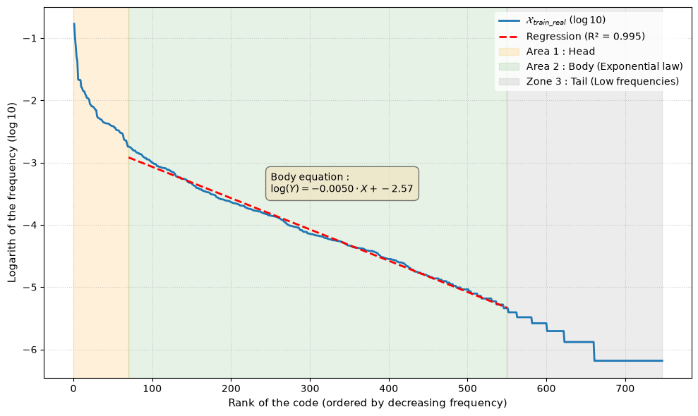
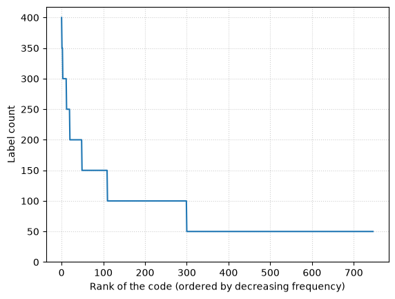
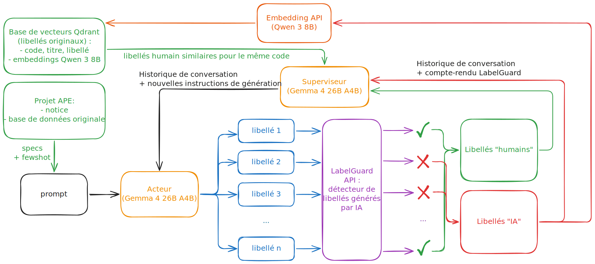

```{=html}
<span class="report-kicker">Rapport de stage</span>
```

**Tuteur de stage :** Meilame Tayebjee, SSP Lab (Insee)

# Abstract {#sec-summary .unnumbered}

*[TBD]*


# Préambule {#sec-preambule .unnumbered}

Mon stage s'est déroulé à l'Institut National de la Statistique et des Etudes Economiques (Insee), et plus précisément au sein de son laboratoire d'innovation : le SSP Lab. Très centré autour du traitement automatique du langage, j'ai été amené à travailler sur la génération de données synthétiques textuelles. Ce rapport présente ma démarche, les difficultés rencontrées ainsi que les résultats que j'ai obtenus. Il se termine par un regard critique sur les contributions apportées et sur les perspectives envisagées.

# Remerciements {#sec-remerciements .unnumbered}

*[TBD]*

# Introduction

### Le défi de la codification automatique de la NAF

Classer des textes dans des catégories fixes (appelées nomenclatures) est essentiel pour produire des statistiques publiques de qualité. D'un côté, les chiffres publiés doivent être précis pour éclairer le débat économique. Prenez l'Indice des Prix à la Consommation (IPC) qui mesure l'inflation, celui-ci utilise la nomenclature internationale COICOP [@inseecoicop] pour donner le bon poids à chaque type de dépense des ménages. D'un autre côté, respecter ces catégories est souvent une obligation légale : chaque pays de l'Union européenne doit classer l'activité économique de ses entreprises selon la Nomenclature statistique des Activités économiques dans la Communauté Européenne (NACE) [@statbelnace].

En pratique, appliquer ce système à l'échelle d'un pays pose de gros problèmes industriels. Il faut d'abord créer un guide très précis (la notice de codification), puis être capable de gérer un flux massif de données. En France, la version nationale de la NACE s'appelle la Nomenclature d'Activité Française (NAF). Elle impose d'associer chaque année des millions d'établissements d'entreprise à l'un des 747 codes existants. À l'origine, ce travail était fait par des agents administratifs qui lisaient la description textuelle écrite par les créateurs d'entreprises. Mais face à ce volume énorme, il est devenu indispensable d'automatiser le processus avec des méthodes de traitement automatique du langage (*Natural Language Processing*, NLP) pour aider les agents et limiter les erreurs.

### Déséquilibre extrême et limites du secret statistique

Pour entraîner un classifieur de type *Text2Code* (du texte vers le code), on se heurte à un problème classique en IA : le déséquilibre extrême des classes (*long-tail classification*). Les données réelles ne couvrent pas toutes les catégories de la même manière. Les activités courantes saturent le début de la distribution, tandis que la majorité des codes de la nomenclature se situent dans la "queue de distribution", où il n'y a presque aucun exemple.

Les chiffres de la NAF 2025 montrent bien ce déséquilibre : sur un fichier d'entraînement de plus d'un million de libellés réels, un code sur deux comprend moins de 60 exemples. À cause de cette rareté, les modèles supervisés classiques ne parviennent pas à apprendre ces catégories, ce qui crée des erreurs importantes lors de la mise en production.

À cela s'ajoutent deux contraintes majeures :

1. Quand une nomenclature est mise à jour ou que les tendances changent dans les créations d'entreprise, cela crée un décalage immédiat (*distribution shift*) entre les données passées et les nouvelles données réelles. Un bon exemple est la popularité récente des logements meublés non professionnels (LMNP) qui a fait grimper le nombre de codes `68.20G`, anciennement `68.20A` (NAF 2008).
2. La loi sur le secret statistique et le RGPD interdisent de diffuser ces vrais fichiers à des personnes extérieures (pour des cours, des hackathons ou des concours d'écoles). Ce manque de données ouvertes empêche la communauté scientifique de tester de nouveaux modèles sur ces sujets et donc de contribuer à des progrès technologiques.


### Tension entre performance de classification et fidélité de diffusion

Le système de codification automatique utilisé depuis novembre 2022 à l'Insee repose sur FastText [@bojanowski2017enriching]. S'il permet de traiter seul environ 70 % des cas les plus simples, ce modèle n'est plus à jour face aux architectures modernes de l'état de l'art, comme les transformeurs légers [@sanh2019distilbert] ou les encodeurs denses [@reimers2019sentence], qui offrent de bien meilleures capacités de compréhension contextuelle. De plus, les retours métiers des experts de la nomenclature mettent régulièrement en évidence des erreurs de prédiction de ce classifieur. Une voie majeure pour franchir un cap en performance réside dans l'augmentation du jeu de données d'entraînement par l'injection de données synthétiques issues de grands modèles de langage (LLM).

Cependant, l'introduction de ces données synthétiques au sein d'un flux de production réel soulève des défis théoriques profonds. En s'appuyant sur le cadre de référence du décalage de données (*dataset shift*) théorisé par @quinonero2008dataset, notre cas d'étude est confronté à trois mécanismes potentitels de décalage de la loi jointe $P(X, Y)$ (où $X$ représente le libellé textuel et $Y$ le code de la nomenclature) :

1. **Le *prior probability shift* :** Il intervient lorsque la distribution des classes $P(Y)$ est modifiée. La nomenclature réelle présente une distribution très déséquilibrée. Pour aider un classifieur à apprendre les catégories rares, la pratique classique en apprentissage automatique consiste à modifier artificiellement $P(Y)$ (par exemple via une loi uniforme), créant un *prior shift* volontaire par rapport au flux réel.
2. **Le *covariate shift* :** Il apparaît lorsque la distribution des variables explicatives $P(X)$ change. C'est le risque majeur de la génération synthétique naïve : un LLM non guidé produit des textes académiques, parfaits et sans défauts. Sa distribution $P_{synth}(X|Y)$ présente un décalage de domaine critique par rapport au style empirique des déclarants humains $P_{real}(X|Y)$ (caractérisé par des fautes, des abréviations et des structures hachées).
3. **Le *concept drift***, théorisé par [@tsymbal2004problem] : Il se traduit par une modification de la règle de décision $P(Y|X)$. C'est le point de départ de notre étude, matérialisé par le passage à la nouvelle nomenclature NAF 2025. Un même libellé textuel peut changer de catégorie légale par rapport aux années précédentes. Dans notre cas, ce shift est documenté et encadré par la notice officielle.

La tension de notre travail réside dans le fait que la création d'un jeu de données optimisé pour l'apprentissage d'un classifieur ne coïncide pas naturellement avec celle d'un jeu de données destiné à la diffusion publique (*open-data*). L'objectif de diffusion pure exige de mimer fidèlement la distribution $P(X)$ réelle qui contient des libellés hors-sujets (valeurs aberrantes) et demande la même distribution $P(Y)$, alors que l'optimisation du classifieur demande une stratégie inverse sur $P(Y)$ et un contrôle strict de la pertinence du bruit textuel injecté.

### Approche proposée et contributions

Pour articuler ces objectifs sans qu'ils ne se nuisent, nous proposons de **découpler la structure de la nomenclature de l'expression humaine en utilisant le LLM pour réduire le *covariate shift* au niveau conditionnel, c'est-à-dire pour chaque code $Y$**.

Notre approche consiste à guider le processus de génération pour que la distribution conditionnelle synthétique $P_{synth}(X | Y)$ converge vers la distribution humaine $P_{real}(X | Y)$. Plutôt que de laisser le LLM dériver vers son style académique naturel, nous lui apprenons à transférer le style et la texture sémantique des déclarants (abréviations, syntaxe métier brute) sur la base des concepts immuables de la notice. Une fois ce générateur conditionnel robuste obtenu, la dualité des cas d'usage se résout par simple manipulation de la loi d'échantillonnage des codes $P(Y)$ en entrée du pipeline : le *prior probability shift* est ainsi annulé pour le scénario de diffusion open-data, ou volontairement exploité (distribution uniforme) pour maximiser les performances du classifieur aval sur la queue de distribution.

Les contributions principales de ce travail sont :

* **La création de `LabelGuard` :** Un discriminateur capable de détecter le *covariate shift* entre les styles employés par le LLM et l'humain, mettant en évidence l'empreinte (*watermark*) laissée par les modèles de langage dans l'espace des plongements vectoriels.
* **L'architecture `Code2ReText` :** Un framework agentique à deux LLM (Générateur-Superviseur) qui utilise le signal de `LabelGuard` pour forcer l'alignement stylistique et réduire le *covariate shift* conditionnel.
* **Une évaluation par ensembles imbriqués (protocole $\mathcal{M}_\alpha$) :** Une analyse fine de l'influence de la proportion de données synthétiques sur le classifieur `Text2Code`, isolant les gains spécifiques sur les classes de faible fréquence et identifiant le point de saturation synthétique.
* **Un pipeline reproductible :** Un code entièrement open source et agnostique, conçu pour être immédiatement transposable à d'autres nomenclatures hiérarchiques (comme la NACE européenne).

Le reste de ce rapport est structuré ainsi. La Section 2 présente l'état de l'art de la génération de données en NLP. La Section 3 détaille la donnée utilisée, et la section 4 introduit un premier générateur : `NaiveCode2Text`. La section 5 aborde le fonctionnement de `LabelGuard`, base pour la section 6 sur `Code2ReText`. La Section 7 décrit les méthodes d'évaluation, dont les résultats sont présenté section 8. Le rapport se termine par une conclusion et présente des perspectives de travail.


# État de l'Art

## Augmentation de données textuelles par des modèles de langage

Avant l'avènement des grands modèles de langage, l'augmentation de données textuelles en NLP reposait principalement sur des règles de transformation de surface ou des substitutions locales. Les approches traditionnelles exploitent des perturbations syntaxiques, du remplacement lexical basé sur des thésaurus comme WordNet, ou des techniques de traduction aller-retour (*back-translation*) [@shorten2021]. Bien que ces méthodes permettent d'accroître artificiellement le volume du corpus d'entraînement, elles souffrent d'une forte rigidité sémantique : elles se contentent de reformuler les structures existantes sans introduire de nouveaux concepts ni enrichir le vocabulaire métier.

L'introduction des grands modèles de langage (LLM) a transformé ce domaine en permettant une génération de données textuelles sensible au contexte. L'approche la plus courante repose sur l'apprentissage en contexte (*in-context learning*) via des techniques de *few-shot prompting* [@brown2020]. Dans ce cadre, le modèle reçoit une poignée d'exemples issus du jeu de données réel pour assimiler le style, la structure et le ton des libellés cibles. Des frameworks plus avancés incitent le LLM à générer des variations textuelles en introduisant des contraintes de diversité sémantique ou linguistique directement dans le prompt [@schick2021].

Une étape fondatrice dans la génération de données textuelle est Self-Instruct proposé par @wang2023self. L'idée consiste à utiliser un LLM pour générer automatiquement des paires instruction-réponse qui serviront ensuite à entraîner ou spécialiser un autre modèle. Cette approche a démontré qu'un système pouvait améliorer ses performances à partir de données qu'il avait lui-même contribué à produire.

Néanmoins, qu'elles soient basées sur des règles heuristiques ou sur du *few-shot prompting*, ces méthodologies partagent une limite fondamentale : la donnée générée demeure intrinsèquement bornée par le périmètre informationnel du jeu de données d'origine. En l'absence d'un référentiel externe, le modèle ne fait que cloner, interpoler ou reformuler des concepts déjà présents dans l'échantillon initial. Il est incapable d'explorer des thématiques absentes ou sous-représentées, ce qui expose le système au risque de propager, voire d'amplifier, les biais de sélection de la base de données source.

## Génération synthétique pilotée par connaissances externes

Pour s'affranchir de la dépendance aux données historiques, plusieurs travaux explorent l'injection de connaissances structurées exogènes au sein des architectures génératives, un domaine désigné sous le terme de génération guidée par taxonomie (*taxonomy-guided generation*). Dans notre cadre applicatif, la présence d'une notice officielle constitue une ressource documentaire exhaustive et immuable, qui fournit pour chaque catégorie son code, son titre, ainsi que ses critères d'inclusion et d'exclusion.

Historiquement, l'intégration de telles connaissances nécessitait le développement d'architectures dédiées. Par exemple, @chen2020kgpt introduisent le framework KGPT, qui repose sur un pré-entraînement lourd et spécifique pour aligner des structures de données (graphes de connaissances) avec du texte. Cette stratégie s'avère plus coûteuse à mettre en œuvre que les LLMs actuels, et donc moins adaptée à notre cas d'usage.

L'apparition des grands modèles de langage a favorisé une approche plus flexible fondée sur la récupération d'information (*retrieval*). Dans les systèmes de *Retrieval-Augmented Generation* (RAG), introduits par @lewis2020retrieval, le modèle ne s'appuie plus uniquement sur ses connaissances paramétriques : il consulte d'abord une source documentaire externe avant de produire sa réponse. Cette stratégie permet d'améliorer la factualité des contenus générés tout en facilitant l'adaptation à des domaines spécialisés.

Dans le cadre de la génération de données synthétiques, des travaux récents montrent que l'utilisation de documents récupérés dynamiquement améliore la pertinence et la diversité des exemples produits. Les informations externes peuvent être injectées sous différentes formes : passages textuels, exemples similaires retrouvés dans un espace d'embedding, taxonomies hiérarchiques ou bases de connaissances structurées [@long2024llms].

Notre cas d'étude présente une situation particulièrement favorable à ce type de méthode. Contrairement à de nombreux contextes applicatifs où les connaissances doivent être recherchées dans de larges corpus, l'ensemble de l'information pertinente peut être injecté directement dans la fenêtre de contexte du modèle. Notre approche peut ainsi être interprétée comme une forme spécialisée de génération augmentée par récupération, où la notice joue le rôle de source documentaire de référence. L'objectif n'est cependant pas la production d'une réponse à une question utilisateur, mais la génération de libellés synthétiques destinés à l'entraînement d'un classifieur Text2Code. La qualité du système dépend alors de sa capacité à transformer cette connaissance normative en formulations proches du langage réellement employé par les déclarants.

## Transfert de style

L'utilisation exclusive de la notice comme source d'inspiration introduit un biais stylistique. Par construction, les LLMs subissent un alignement strict conçu pour éliminer les erreurs de syntaxe et produire un langage formel, neutre et grammaticalement parfait. Cela peut être dû au *Reinforcement Learning from Human Feedback* (RLHF) [@ouyang2022training], au *Supervised-Fine-Tuning* (SFT) [@zhang2026instruction], où à d'autres facteurs. @reinhart2025do confirment la différence de style avec le langage humain, qui change selon les modèles mais reste toujours présente.

Ce phénomène crée un *covariate shift* : comme le prouvent @belinkov2018synthetic, les modèles en NLP ont des difficultés à faire face à du bruit inconnu. Dans notre cas, un classifieur entraîné sur des textes parfaits issus des données synthétiques pourrait donc subir une baisse drastique de ses performances lorsqu'il est confronté au bruit des données originales. Pour corriger ce décalage, il est nécessaire de recourir au transfert de style (*style transfer*). @gao2023self montrent qu'un processus de réécriture grâce à une série de dialogues entre LLMs devance le *few-shot prompting* en terme de performances pour les tâches. Pour du transfert de style, cela permettrait de mimer le comportement des déclarants réels en introduisant un bruit anthropique ciblé (abréviations métiers, troncatures de mots, fautes d'orthographe de saisie).

## Evaluation

Pour rappel, nous souhaitons que $P_{synth}( \cdot | Y)$ converge vers $P_{real}( \cdot | Y)$ pour tout code $Y$ de sorte à atteindre le double objectif d'amélioration des performances du classifieur Text2Code et de diffusion des données. Plusieurs méthodes d'évaluation s'offrent à nous.

Pour la partie performances, le protocole *Train on Synthetic, Test on Real* (TSTR), formalisé par @esteban2017real, est très adapté. L'idée est d'entraîner le classifieur uniquement sur la donnée synthétique, et d'évaluer uniquement sur la donnée originale.

Pour quantifier la réduction du *covariate shift*, une solution peut être d'utiliser des discriminateurs entraînés à distinguer les productions humaines des productions synthétiques [@bowman2016generating]. Dans ce cadre d'évaluation antagoniste, l'exactitude du discriminateur sert de proxy pour mesurer la convergence stylistique : une baisse de sa capacité de détection indique que le générateur parvient à effacer sa signature pour s'aligner sur la sémantique humaine. 

Plus généralement, des métriques de similarités entre des données textuelles existent. De simples comparaisons entre les mots employés comme avec le *Jaccard Similarity Index* [@travieso2024analytical], jusqu'à l'*Integrated Maximum Mean Discrepancy* (IMMD) [@ding2025testing], plein de métriques permettent de comparer deux corpus de textes --- ici, données synthétiques et données réelles pour un même code. La limite de ces approches réside dans l'incapacité à mesurer la créativité des données synthétiques, ce que l'on cherche pourtant si on veut améliorer la classification ou diffuser des données qui ne soient pas des copies propres des données originales. C'est pourquoi ces métriques seront moins mises en valeurs face aux deux premières.


# La donnée disponible {#sec-data}

Pour rappel, l'étude se concentre sur le cas de la NAF 2025, mais la structure des données utilisées est très similaire à d'autres nomenclatures et donc appliquable dans d'autres cas, tant qu'il y a bien une notice exhaustive.

## La notice de la nomenclature

La notice NAF 2025 a une structure hiérarchique sur cinq niveaux emboîtés. Elle est composée de 21 sections, 87 divisions, 287 groupes, 651 classes et 747 sous-classes, de sorte à partager des points communs avec les nomenclatures européennes et internationales d'activités d'entreprise [@insee2025naf]. On peut retrouver tous les détails sous forme de tableau dans un fichier `.xlsx` avec les attributs suivants pour chaque catégorie :

- **Code** : chaîne de caractère courte unique à chaque catégorie, dont l'écriture conserve l'aspect hiérarchique.
-	**Titre**	: nom décrivant la catégorie.
- **Code du parent** : code de la catégorie de niveau supérieur (si elle existe).
- **Niveau** : niveau de hiérarchie de la catégorie (de 1 à 5 ici).
- **Includes** : tous les éléments inclus dans la catégorie.
- **IncludesAlso** : d'autres éléments inclus dans la catégorie.
- **Excludes** : tous les éléments exclus de la catégorie, mais qui ressemblent à ceux inclus.

D'autres éléments peuvent être présents mais sont redondants par rapport aux informations indiquées ci-dessus. Un exemple de notice détaillée se trouve en annexe.

On notera $\mathcal{Y}$ l'ensemble des codes (uniques) des sous-classes de la NAF 2025. On a $|\mathcal{Y}| = 747$. Par simplicité, en dehors de cette sous-partie, le mot code dans le rapport désigne un code dans $\mathcal{Y}$.
 
## Les données orginales

Le choix de la NAF 2025 n'est pas annodin dans notre cas. En plus de comporter une notice exhaustive sans aucun attribut vide, la base de données originale est très large et déjà travaillée dans d'autres projets en science des données à l'Insee. Cela donne plus de légitimité à son utilisation comme base de travail, même si des erreurs d'annotations peuvent persister (voir en annexe).

La donnée originale provient de formulaires remplis pour la création ou de modification d'établissements d'entreprise (création d'un nouveau SIRET) entre le 8 novembre 2022 et 27 octobre 2024. Elle est divisée en trois grands groupes indépendants :

- $\mathcal{X}_{train\_real}$ : la donnée d'entraînement, composée de $1\,523\,268$ lignes. Elle est utilisée pour l'entraînement de modèles et pour la génération de données.
- $\mathcal{X}_{val}$ : la donnée de validation, composée $380\,631$ lignes. Elle est utilisée uniquement pour suivre les performances durant l'entraînement des codifieurs automatiques. 
- $\mathcal{X}_{test}$ : la donnée de test, composée $475\,788$ lignes. Elle est uniquement exploitée pour calculer les performances finales des codifieurs après leur entraînement.

Chacune de ces bases de données est composée d'un libellé, d'un code associé (dans deux tiers de cas par un codificateur automatique, sinon par un humain), et de variables catégorielles supplémentaires (que l'on n'utilisera pas ici). 

## Présence de bruit dans la donnée

La donnée de travail a certaines particularités qu'il est nécessaire de présenter pour avoir un regard plus critique sur les résultats de cette étude. En effet, parce que c'est la donnée d'entraînement pour *Text2Code* sur la NAF 2025, cette base a subi un traitement qui peut générer un bruit dans nos résultats.

Premièrement, la taille des trois groupes indépendants a été augmentée artificiellement à la mi-mai 2026 pour modifier la distribution des codes les plus fréquents et éviter des mauvaises classifications du modèle en production. La première partie du stage a donc été réalisée avec une base de donnée $\mathcal{X}_{train\_real}$ d'environ $800\,000$ lignes à la place, qui reflète la véritabe distribution des codes. Les travaux exploitant cette base plus petite sont NaiveCode2Text (pour le few-shot) et LabelGuard (pour l'entraînement). Pour les travaux suivants, le jeu de données a donc changé de distribution en rajoutant artificiellement des copies de libellés déjà existants.

Par ailleurs, entre le 8 novembre 2022 et le 27 octobre 2024, la nomenclature utilisée était la NAF 2008. La codification en NAF 2025 s'est faite en post-production grâce à un LLM alimenté de la table de correspondance fournie par l'Insee ainsi que de consignes d'annotations humaines. Cependant, au moment de la transition de nomenclature, la table n'était pas totalement complète, et les consignes n'étaient pas exhaustives : des erreurs de codes ont donc pu apparaître. 

Enfin, le jeu de donnée d'entraînement contient des paires $(libellé, code)$ incorrectes. Il est composé aux deux tiers de codes classifiés automatiquement par un modèle FastText (lorsque que la confiance dépasse un certain seuil), le reste des codes étant traités manuellement par l'humain. D'une part, l'annotation humaine n'est pas parfaite pour de multiples raisons : manque d'alignement des agents sur les cas aux frontières, volume de codes à traiter réduisant le temps d'attention par libellé, ... Il est difficile d'estimer la fraction de paires concernées, mais les réunions d'harmonisation fréquentes confirment ce biais. D'autre part, le modèle a une exactitude globale (*accuracy*) d'un peu moins de $90\%$ pour les cas qu'il traite, ce qui rajoute donc du bruit dans les données d'entrainement.

## Distribution des données

La distribution des codes est particulière. En ordonnant les codes par leur fréquence, la [@fig-code-log-freq] montre qu'environ 70 codes constituent la majeure partie de $\mathcal{X}_{train\_real}$, et que les autres codes suivent une distribution exponentielle selon leur rang. Cette distribution inégale impose des précautions lors de l'analyse de performances générales. 

{#fig-code-log-freq fig-alt="Distribution des codes dans $\mathcal{X}_{train\_real}$, composée d'une tête à très haute fréquence (jusqu'à 10%), d'un corps qui suit une loi exponentielle, et d'une queue sous forme de marches (très faibles proportions) mais avec tendance globale la même équation que le corps."}

Par ailleurs, les libellés contiennent des anomalies non négligeables. Pour que les partenaires de l'Insee puissent accéder aux données d'entreprises, les libellés ont été définis avec une taille maximale de 140 caractères (contraintes du format `XML`), et cela pose deux problèmes. Le premier repose du côté du demandeur, qui fait souvent appel à un mandataire qui remplit automatiquement pour lui les champs textuels, et a souvent tendance à copier coller des objets juridiques en activité. Le soucis est qu'un objet juridique est très long et donc tronqué, ce qui le rend imprécis. L'autre problème provient du [Guichet unique](https://www.inpi.fr/decouvrir-inpi/formalites-dentreprises/guichet-unique-formalites-dentreprises-et-registre-national-entreprises) de l'Institut National de la Propriété Industrielle (INPI), qui a pour but d'aider aux démarches. Ses agents peuvent remplir plus que 140 caractères dans la section libellés, et ceux-ci ne sont pas tronqués.

Alors, si on s'intéresse à la distribution de la longueur des libellés dans $\mathcal{X}_{real\_train}$ (**voir la [fig-hist-label-len] intéractive -> trop couteuse en RAM**), on remarque des pics énormes aux valeurs 141 et 161 qui correspondent au troncage suivi d'un espace, et potentiellement du suffixe "activité de services" (ajout d'une information supplémentaire dans le prétraitement de la donnée). Le code `68.20H` --- qui correspond à la location de biens immobiliers autre que des logements --- est prépondérant parmi les anomalies, et trois quarts des libellés associés ne sont pas uniques. En s'intéressant aux libellés tronqués les plus récurents, ce sont toujours des objets sociaux tronqués. Des précautions sont donc à prendre pour la suite.

<!-- ::: {#fig-hist-label-len}

<iframe src="images/hist_label_len.html" width="100%" height="550px" frameborder="0" scrolling="no"></iframe>

Distribution des longueurs de libellés dans $\mathcal{X}_{train\_real}$
::: -->

# NaiveCode2Text : Approche initiale pour la génération de données synthétiques
### Préambule sur la génération de texte

La génération de données textuelles a été réalisée grâce à des LLMs. L'Insee détient sa propre infrastructure de calcul, sur laquelle plusieurs modèles *open-weight* sont utilisables. Ces modèles pré-entrainés ont pour particularité d'être téléchargeables en ligne gratuitement (souvent sur HuggingFace) et déployables par n'importe qui à condition d'avoir les ressources nécessaires. Nous avons ainsi utilisé `google/gemma-3-27b-it` [@gemma3] pour NaiveCode2Text.

Il est à savoir que d'autres modèles --- par exemple `openai/gpt-oss-120b` [@openai2025gptoss] --- ont été testés initialement. Les différences entre les LLMs n'étant pas notables qualitativement, le choix a été de garder le modèle le plus utilisé par les équipes à l'Insee pour deux raisons. Déjà, celles-ci sont les plus susceptibles de reprendre les travaux réalisés, donc autant faciliter la reproductibilité du travail. Aussi, les modèles génératifs Gemma sont devenus agentiques à partir de Gemma 3, permettant des réflexions plus complexes, et surtout l'appel d'outils --- fonction utile par la suite. `google/gemma-4-26b-a4b-it` [@gemma4] est sorti malheureusement peu de temps après la génération de NaiveCode2Text, il ne sera utilisé que pour Code2ReText. 

## Principe général de NaiveCode2Text

L'approche NaiveCode2Text constitue la base du projet. Son principe est simple : pour chaque code de la nomenclature, nous extrayons les informations pertinentes de la notice (code, titre, quelques éléments *Includes*/*IncludesAlso*, tous les éléments *Excludes*), puis nous les fournissons en contexte au LLM auquel nous demandons de générer un certain nombre de libellés. Nous pouvons également rajouter des exemples de libellés issus du jeu de données original d'entraînement $\mathcal{X}_{train\_real}$ pour faire du *few-shot learning*. Le détail du processus est expliqué [@fig-naive-single].

{#fig-naive-single fig-alt="Schéma du pipeline NaiveCode2Text avec une seule requête"}

Pour cette structure de génération, les facteurs modifiables sont :

- le nombre de libellés à générer à chaque appel,
- le nombre d'éléments *Includes*,
- le nombre d'exemples de libellés,
- les consignes de génération dans le *system prompt* (retrouvable en annexe).

## Passage à l'échelle : parallélisation {#sec-parallelisation}

Pour traiter une nomenclature entière en temps raisonnable, le schéma de base a été adapté pour lancer des requêtes API en parallèle. Plutôt que d'interroger le modèle successivement pour chaque code, nous envoyons simultanément un lot de requêtes indépendantes de manière asynchrone grâce à des sémaphores. Leur principe est de lancer en concurrence plusieurs instructions (concurrence maximale de 50 dans notre cas), et de remplacer tout processus terminé par le premier dans la file d'attente. Sachant que la majorité du temps passé à générer la donnée consiste à attendre la réponse de l'API, paralléliser les appels permet d'atteindre des débits de génération significativement plus élevés (sous réserve de ressources du côté serveur). L'architecture finale est présentée @fig-naive-parallel. 

{#fig-naive-parallel fig-alt="Schéma du pipeline NaiveCode2Text avec requêtes parallèles"}

Une première génération comprenant au total $62\,100$ libellés a été réalisée en 42 minutes avec pour idée de recenser tous les cas possibles dans la notice. Alors, tous les 5 éléments *Includes* ou *IncludesAlso* d'un code, au moins 5 appels demandant à chaque fois 10 libellés étaient faits au LLM. 6 exemples *few-shot* de libellés provenant du même code étaient fournis par prompt, sauf pour les codes rares qui ne fournissaient que le maximum d'exemples possibles (voir @sec-data pour la distribution hétérogène). La distribution finale du nombre de libellés par code est représentée @fig-label-count-synth-naive.

{#fig-label-count-synth-naive fig-alt="Distribution des codes de NaiveCode2Text. Plus de la moitié des codes sont à 50 libellés, un quart est à 100, une très fine proportion dépasse ce niveau et peut atteindre jusqu'à 400 libellés."}

Les libellés générés étaient très techniques et satisfaisants d'un point de vue métier (plus de détails accordés dans @sec-resultats). Cependant, une lecture qualitative rapide faisait déjà apparaître des tournures de phrases qui changeaient des textes originaux. Les changements de *system prompts* n'y faisant rien, nous avons décidé de créer un discriminateur à la fois comme métrique mais aussi comme outil pour une génération améliorée.


# LabelGuard : discriminateur et évaluateur

LabelGuard est un discriminateur entraîné pour distinguer les libellés générés par IA des libellés originaux humains. L'architecture prend en entrée un vecteur représentant le libellé (*embedding*) et retourne une valeur entre 0 et 1, 0 signifant humain, et 1 IA. 

## Données utilisées

Le jeu de données d'entraînement pour LabelGuard a une taille de $160\,000$ libellés, dont $80\,000$ synthétiques et $80\,000$ originaux. Un jeu de données de validation de $40\,000$ textes a également été créé avec une proportion égale IA/humain. Pour limiter au mieux l'influence de facteurs extérieurs au style des libellés, plusieurs stratégies ont été employées.

D'abord, la base de données originale provenant de $\mathcal{X}_{real\_train}$ a été pré-traitée comme suit :

1. **Suppression des anomalies** : les libellés comprenant exactement 141 et 161 caractères ont été retirés, car ils sont pour la grande majorité tronqués.
2. **Suppression des marques personnelles** : même si cela n'a pas été décris dans la [@sec-data], certains libellés contiennent des données personnelles. Cela peut être des SIREN ou des codes postaux que l'on ne souhaite pas inclure comme facteur discriminant car marque trop simple pour discriminer. Tous les libellés ayant plus de deux chiffres (sans être un pourcentage) sont donc supprimés.
3. **Suppression des libellés hors-sujet** : certains libellés ne décrivent pas l'activité d'entreprise mais plutôt quelque chose comme "Je souhaite avoir un SIRET au plus vite". Ces phrases tounées personnellement et peu nombreuses ont été supprimées.
4. **Suppression de suffixes** : le suffixe "activité de services" est très utilisé dans les libellés originaux (information supplémentaire ajoutée qui n'apparait pas dans le code initial), il a donc été retiré pour tous les textes l'incluant à la fin.

Après avoir modifié $\mathcal{X}_{real\_train}$, nous avons échantilloné d'abord 5 libellés par code avec remise (pour les codes rares notamment), puis échantilloné le reste des libellés parmi les données restantes pour atteindre une taille de $100\,000$. Ensuite, la base de donnée synthétique $\mathcal{X}_{synth}$ (issue de la génération quasi-uniforme de NaiveCode2Text) a été échantillonnée avec remise en respectant la distribution des codes originaux (pour un même code, le même nombre de libellés originaux et synthétiques existent).

Finalement, le jeu de donnée obtenu (de taille $200\,000$) a été divisé dans des proportions $80\%/20\%$ en jeux d'entraînement et de validation. Tous les libellés ont ensuite été transformé en *embeddings* de dimension $4\,096$ avec `Qwen/Qwen3-Embedding-8B`.

Il est à noter que, par soucis de coût de génération et de distribution des codes de la donnée synthétique (presque uniforme), les libellés pour les codes les plus populaires dans $\mathcal{X}_{real\_train}$ (modifiée) ont été tirés potentiellement un très grand nombre de fois dans $\mathcal{X}_{synth}$. Le problème posé par l'échantillonage est néanmoins à relativiser devant le grand nombre de libellés identiques dans la donnée originale (plus des deux tiers des libellés sont des copies des autres).

## Sélection du modèle optimal

Pour avoir la version de LabelGuard la plus adaptée à notre cas, nous avons cherché à minimiser le taux de faux-positifs (*False Positive Rate*, FPR) tout en préservant une bonne *accuracy* sur la donnée de validation pour éviter le plus possible de mal classifier les libellés avec le style humain.

Plusieurs modèles ont été essayés avec différents hyperparamètres pour la prédiction : régression logistique, machine à vecteurs de support (SVM) [@cortes1995support], XGBoost [@chen2016xgboost], ou perceptron multicouche (MLP) [@murtagh1991multilayer]. Voici les configurations essayées (les bibliothèque python sont indiquées entre parenthèses) :

- **Régression logistique** (`scikit learn`) : $C \in \{0.1, 1.0, 10.0\}$
- **SVM** (`scikit learn`) : $C \in \{0.1, 1.0, 10.0\}$
- **XGBoost** (`xgboost`) : $(max\_depth, n\_estimators) \in \{(3, 50), (3, 100), (3, 200), (6, 50), (6, 100), (6, 200)\}$
- **MLP** (`pytorch-lightning`) : $(hidden\_layers, dropout\_layers, learning\_rate) \in \{([1024, 256], [0.3, 0], 0.01), ([1024, 256], [0.3, 0], 0.001), ([1024, 512, 256], [0.3, 0.2, 0], 0.01), ([1024, 512, 256], [0.3, 0.2, 0], 0.001)\}$

De manière générale, les modèles les plus performants après entraînement étaient de la classe MLP (en *accuracy* et en FPR). Celui retenu a la configuration $(hidden\_layers, dropout\_layers, learning\_rate) =([1024, 256], [0.3, 0], 0.001)$, car il a moins de couches cachées et des performances presque identiques à des MLP à trois couches cachées. Un détail des résultats est retrouvable en annexe.


## Mesure de l'empreinte du LLM : Analyse de la séparabilité des distributions {#sec-labelguard-res}

Un point est particulièrement alarmant pour LabelGuard : il ne se trompe presque jamais. Pour $40\,000$ libellés de validation, on obtient $99.4\%$ d'*accuracy* et $0.7\%$ de FPR --- soit seulement $139$ libellés faux positifs. Ces performances restent du même acabit si on réduit drastiquement le nombre de données d'entraînement, ce qui témoigne que ce n'est pas un simple overfitting du modèle déployé mais bien de la présence d'une empreinte (*watermak*) propre au LLM qu'il faut pouvoir identifier.

*[Analyse à faire : détail des FPR, jeu de la ponctuation, ...]*


# Code2ReText : changer le style par alignement Acteur-Superviseur

LabelGuard parvient à différencier les libellés humains et ceux générés par IA : nous pouvons donc l'exploiter pour créer un nouveau générateur qui parvient à le tromper. Code2ReText a donc été créé avec pour objectif de lui faire reformuler ses libellés lorsqu'ils sont détectés comme IA par LabelGuard.

Il est à savoir que Code2ReText a été conçu peu de temps après la sortie de Gemma 4, et notamment de la version `google/gemma-4-26b-a4b-it` [@gemma4] qui est rapide et performant. Le LLM a été adopté très rapidement à l'Insee, et a donc été utilisé pour Code2ReText.

## Framework Double-LLM : Acteur génératif et Superviseur évaluatif

L'idée initiale de Code2ReText était de fournir simplement au LLM les outils (*tools*) pour évaluer sa génération, chercher des libellés similaires à ceux qu'il génère, et lui permettre ainsi de reformuler les libellés générés, comme présenté @fig-retext-agentic. Au départ, nous utilisions la bibliothèque `openai-python` [@openaipython2024] pour donner les *tools* et récupérions seulement les libellés finaux. Cependant, nous avons remarqué que fournir au même agent l'accès presque illimité à un discriminateur lui permettait de tricher et d'outrepasser les consignes. En effet, dès les premiers essais, il a commencé à concaténer des mots entre eux --- voire à écrire des mots inintelligibles --- et à recopier les libellés validés par le discrimateur pour l'ensemble de sa génération. 

{#fig-retext-agentic fig-alt="Schéma Code2ReText en version agentique"}

Face à cela, nous avons fait deux choix pour Code2ReText. Premièrement, nous avons décidé de prendre plus de contrôle sur le LLM en utilisant LangGraph, un orchestrateur open-source [@langgraph2024] qui offre des fonctionnalités plus avancées dans l'utilisation de *tools* mais surtout dans le suivi. Aussi, nous sommes passé d'un schéma à un LLM à une paire Acteur/Superviseur.  L'Acteur est calqué sur le fonctionnement de NaiveCode2Text, avec la possibilité additionnelle de reformuler ses libellés. Le Superviseur quant à lui reçoit à chaque boucle les libellés générés par l'Acteur avec les résultats de LabelGuard et des libellés originaux similaires provenant du même code. Il formule alors des consignes pour l'Acteur de sorte à ce qu'il reformule les libellés discriminés (score fourni par LabelGuard supérieur à 0.70) en des libellés dans le style de ceux qui sont passés et/ou des originaux. Pour éviter de recopier les libellés originaux, le Superviseur a pour consigne de ne pas transmettre ceux auxquels il a accès, et l'Acteur ne peut que changer le style des libellés qu'il a générés sans pouvoir modifier le fond. Un maximum de 5 boucles est autorisé. Un schéma récapitulatif est affiché @fig-retext.

{#fig-retext fig-alt="Schéma Code2ReText"}

## Validation de la démarche

*[Parler diminution des discrimination par step (moyenne et distrib), choix de 15 libellés/code au lieu de 10, consignes récurrentes et analyse qualitative (presque plus de stop words mais formulation moins complexe, plus humaine)]*


# Protocole d'évaluation globale de la génération

L'évaluation se fait sur plusieurs aspects, du plus au moins important. Elle a pour but à la fois de rendre compte de l'utilité de générer de la donnée synthétique, et de la difficulté d'aligner un LLM sur un style propre à une nomenclature.

## Évaluation des performances d'un classifieur

L'évaluation des données synthétiques par les performances d'un codificateur automatique se déroule en deux phases successives. Une première phase est dédiée à l'optimisation de l'architecture du classifieur sur les données réelles. Une deuxième phase applique cette configuration optimale pour mesurer l'impact de l'injection progressive de données synthétiques via des structures d'ensembles imbriqués.


### Donnée utilisée

Avant de détailler l'évaluation, voici les données à disposition :

* $\mathcal{D}_{real\_train}$ : un dataset de $N_{train} = 50\,000$ lignes issues exclusivement du jeu d'entraînement original $\mathcal{X}_{real\_train}$. Il a été construit en échantillonant au hasard d'abord une ligne de données par code (soit $|\mathcal{Y}| = 747$ lignes), puis $N_{train} - |\mathcal{Y}|$ lignes dans la base restante.
* $\mathcal{D}_{synth}$ : un dataset de $N_{train}$ lignes issues exclusivement d'un jeu de données synthétiques $\mathcal{X}_{synth}$ construit à partir du jeu d'entraînement original $\mathcal{X}_{real\_train}$. $\mathcal{D}_{synth}$ a été construit en échantillonant au hasard d'abord une ligne de données par code (soit $|\mathcal{Y}| = 747$ lignes), puis $N_{train} - |\mathcal{Y}|$ lignes dans la base restante.
* $\mathcal{D}_{val}$ : un dataset de $N_{val} = 30\,000$ lignes, issu exclusivement du jeu de validation original $\mathcal{X}_{val}$. Il a été construit en échantillonant $N_{val}$ lignes, sans garantire la représentation de tous les codes. 
* $\mathcal{D}_{test}$ : un dataset de $N_{test} = 30\,000$ lignes, issu exclusivement du jeu de test original $\mathcal{X}_{test}$. Il a été construit en échantillonant $N_{test}$ lignes, sans garantire la représentation de tous les codes.

Pour rappel, les jeux de données $\mathcal{X}_{real\_train}$, $\mathcal{X}_{val}$ et $\mathcal{X}_{test}$ sont indépendants. $\mathcal{X}_{synth}$ a été construit à partir de $\mathcal{X}_{real\_train}$. Cela veut donc dire que $\mathcal{D}_{synth}$ comme $\mathcal{D}_{real\_train}$ sont indépendants de $\mathcal{D}_{val}$, et ces trois ensembles sont eux-mêmes indépendants de $\mathcal{D}_{test}$.

### Phase 1 : Sélection de l'architecture et recherche sur grille

Avant d'introduire la moindre donnée synthétique dans le processus d'apprentissage, il est nécessaire de définir un modèle de classification de référence pour pouvoir obetnir des résultats commensurables. Pour ce faire, la première étape consiste à configurer les hyperparamètres menant au modèle le plus performant par entraînement sur la donnée originale.

La structure initiale est tirée des modèles qui seront prochainement mis en production à l'Insee pour la NAF 2025, à l'exception près que la seule donnée en entrée est le libellé textuel, alors qu'en conditions réelles il y aura également des variables catégorielles. Le détail de l'architecture est retrouvable dans [la documentation de la bibliothèque](https://inseefrlab.github.io/torchTextClassifiers/architecture/overview.html#the-pipeline), et repose sur la mise en série d'un tokenizer, d'un embedder (d'abord au niveau du token puis au niveau du texte entier), ainsi que d'un classifieur. L'embedder et le classifieur sont des réseaux de neurones profonds. Le modèle retourne un score entre 0 et 1 pour chaque code (utilisation de la fonction *softmax* sur les logits retournés par le réseau de neurones), la prédiction étant le code pour lequel le score est le plus proche de 1. 

Une recherche sur grille (*grid search*) est orchestrée sur $\mathcal{D}_{real\_train}$, avec comme donnée de validation $\mathcal{D}_{val}$. L'espace de la *grid search* explore 36 combinaisons à partir des dimensions suivantes :

* **Dimension de la couche de représentation vectorielle (*embedding*, $d_{emb}$)** : $\{32, 64, 128, 256, 512, 1024\}$. Cette couche d'*embedding* permet de projeter les mots du dictionnaire dans un espace vectoriel continu où la proximité géométrique traduit la proximité sémantique.
* **Taux d'apprentissage initial ($\eta$)** : $\{10^{-3}, 5 \cdot 10^{-4}, 10^{-4}\}$. L'optimiseur utilisé est toujours Adam.
* **Pré-traitement du texte ($t$)** : $\{true, false\}$. Cette variable détermine si le texte est conservé sous sa forme brute ou s'il subit une standardisation simple : mise en minuscule, retrait des accents, de la ponctuation, des espaces superflus et des mots vides (*stop words*).

Le nombre maximal de cycles d'apprentissage (*epochs*) est fixé à 15. Ce processus est supervisé par un mécanisme d'arrêt précoce (*early stopping*) configuré avec une patience de 2 *epochs* sur la perte de validation afin d'éviter tout surapprentissage.

À l'issue de ces 24 combinaisons, les modèles sont évalués sur $\mathcal{D}_{test}$. La configuration retenue, notée $\theta^* = (d_{emb}^*, \eta^*, t^*)$, est celle qui présente le meilleur compromis entre les éléments suivant :

- l'exactitude (***accuracy***) pour sa prédiction,
- la fréquence à laquelle le bon code apparait dans les **top 3 et 5** de ses propositions,
- le **taux de prédictions confiantes** (score supérieur à $0.70$ pour un code),
- l'***accuracy* des prédictions confiantes**.

Cette configuration $\theta^*$ est ensuite figée pour servir de référence absolue lors de la phase suivante.

### Phase 2 : Évaluation quantitative par ensembles imbriqués

Une fois les hyperparamètres optimaux $\theta^*$ fixés, nous mesurons l'impact de la substitution des données réelles par les données synthétiques. Pour ce faire, nous initialisons des modèles strictement identiques à l'architecture optimale sélectionnée en Phase 1, mais nous faisons varier la nature de leur environnement d'entraînement.

Nous construisons une suite ordonnée de jeux de données d'entraînement mixtes $\mathcal{M}_{\alpha}$ de taille fixe $N = 50\,000$ lignes, avec $\alpha$ entre 0 (exclus) et 1 (inclus) qui représente le taux d'injection de données synthétiques ($\mathcal{D}_{synth}$) :

$$\mathcal{M}_{\alpha} = \mathcal{C}_{real}(\alpha) \cup \mathcal{C}_{synth}(\alpha)$$

Où $\mathcal{C}_{synth}(\alpha)$ est un sous-ensemble de $\mathcal{D}_{synth}$ de taille $\lfloor \alpha \cdot N \rfloor$, et $\mathcal{C}_{real}(\alpha)$ est un sous-ensemble de $\mathcal{D}_{real\_train}$ de taille $N - \lfloor \alpha \cdot N \rfloor$.

Une contrainte critique de notre approche consiste à immuniser l'apprentissage contre le problème des classes rares ou absentes, tout en garantissant un déterminisme parfait entre les différents taux $\alpha$. Avant tout échantillonnage, $\mathcal{D}_{real\_train}$ et $\mathcal{D}_{synth}$ sont partitionnés en deux sous-structures : la base immuable ($\mathcal{B}$), un bloc fixe de 747 lignes contenant précisément un exemple pour chaque classe de la nomenclature, et le réservoir complémentaire ($\mathcal{R}$), représentant le reste des lignes disponibles, qui sont ensuite mélangées selon une graine aléatoire fixe.

Pour tout taux $\alpha$ différent de 1, le bloc correspondant est assemblé en sélectionnant systématiquement l'intégralité de la base immuable $\mathcal{B}$, complétée par les premières lignes du réservoir complémentaire $\mathcal{R}$. Cette formulation garantit deux propriétés :

* **Couverture à 100%** : Quel que soit le taux d'injection $\alpha$, le classifieur est exposé à au moins un exemple de chacune des 747 classes lors de l'apprentissage.
* **Inclusion stricte** : Pour deux taux $\alpha_1 < \alpha_2$, l'ensemble des données synthétiques utilisées à la première étape est strictement inclus dans celui de la seconde. Réciproquement, pour les données réelles, l'ensemble à $\alpha_2$ est strictement inclus dans celui à $\alpha_1$. Cette monotonie élimine les biais de variance liés à l'échantillonnage aléatoire pur entre les configurations expérimentales.

Pour un taux $\alpha$ égal à 1, on n'entraîne que sur la donnée synthétique. On garde la notion d'imbrication des ensembles synthétiques injectés $\left(\forall \alpha \in (0,1), \mathcal{C}_{synth}(\alpha) \subset \mathcal{C}_{synth}(1)\right)$, mais on perd la base immuable $\mathcal{B}_{real}$ de la donnée originale.

On ne réalise pas d'expérience où $\alpha$ est trop proche de 0 ou de 1, et où donc on ne peut avoir une base immuable dans la donnée originale et dans la donnée synthétique. Sachant que $N_{train} = 50\,000$, cela correspond aux valeurs admises $\alpha \in [0,015, 0,985] \cup \{1\}$.

L'évaluation des performances de la donnée synthétique consistera alors à étudier les mêmes métriques qu'à la phase 1, mais avec différentes proportions $\alpha$ de données synthétiques. On s'intéressera par ailleurs à quelques métriques sur les données d'entraînement $\mathcal{M}_{\alpha}$ qui apportent un regard différent sur les données injectées.


## Evaluation sémantique

### Divergence de style (KL par exemple ?)

*Quelle serai(en)t la/les meilleure(s) métrique(s) pour évaluer si on prend l'aspect distribution/Bayésien* ?

Utiliser également IMMD, possiblement Jaccard Similarity Index ?

### Autres critères d'évaluations

Deux autres critères peuvent être rajoutés dans l'évaluation sémantique. Ils servent essentiellement à se forger des intuitions sur les différences de style entre les libellés originaux, mais ne peuvent pas constituer un critère d'évaluation objectif pour les générations de données vues ici.

La première méthode est purement qualitative, et consiste à comparer les libellés générés avec les originaux en échantillonant une petite partie de chaque et en regardant les différences à l'oeil. Cette technique nous a surtout permis d'orienter les premières réflexions, et nous choisissons de l'utiliser pour permettre aux lecteurs de se rendre compte de la donnée originale que nous ne pouvons pas partager.

La deuxième méthode est le taux de discrimination par LabelGuard. Bien que les résultats du discriminateur @sec-labelguard-res montrent une divergence de style, nous avons utilisé le même modèle pour créer Code2ReText. Etudier les frontières de décisions peut s'avérer utile, mais il y a nécessairement un biais dans l'étude. Nous faisons tout de même le choix de le garder mais demandons de faire preuve de précaution si toute personne met en avant les résultats de LabelGuard pour Code2ReText. 

# Résultats {#sec-resultats}

**TBD**

## Performances du classifieur et analyse du point de saturation synthétique
## Évaluation granulaire : Gains de performance par buckets de fréquence (Classes de Tête vs Classes de Queue)
## Évaluation intrinsèque des datasets : Diversité lexicale et convergence stylistique

*Penser à mettre en avant similarité UMAP mais divergence par LabelGuard*

### NaiveCode2Text

[Les résultats obtenus avec cette approche sont à la fois encourageants et révélateurs d'une limite fondamentale. Du côté positif, la génération s'avère très fidèle à la notice, ce qui garantit une bonne cohérence sémantique entre les libellés générés et les codes correspondants. La diversité thématique est également au rendez-vous, héritée directement de la richesse de la notice.

Cependant, un problème majeur est apparu à l'analyse des données générées : ils sont trop professionnels. Les libellés présentent systématiquement un ton professionnel, une syntaxe et une grammaire irréprochables, et un vocabulaire qui colle de trop près à celui de la notice. En d'autres termes, ils ne ressemblent pas aux libellés réels, qui sont saisis par des humains dans des contextes variés, souvent à la hâte, avec toute l'imperfection que cela implique.]

# Conclusion et Travaux Futurs {.unnumbered}
### Synthèse des contributions
### Du Prompting Agentique au Fine-Tuning Supervisé (SFT) stylistique
### Généralisation à des cadres multilingues (NACE européenne)


# Planning {#sec-planning .unnumbered}

Planning à potentiellement intégrer en conclusion
{#fig-planning fig-alt="Diagramme de planning du stage"}


# Annexe

Détail configuration du classifieur

Prompts de référence

Tableau ML pour le choix du modèle

Erreurs d'annotation

Exemple notice

Résultats LabelGuard