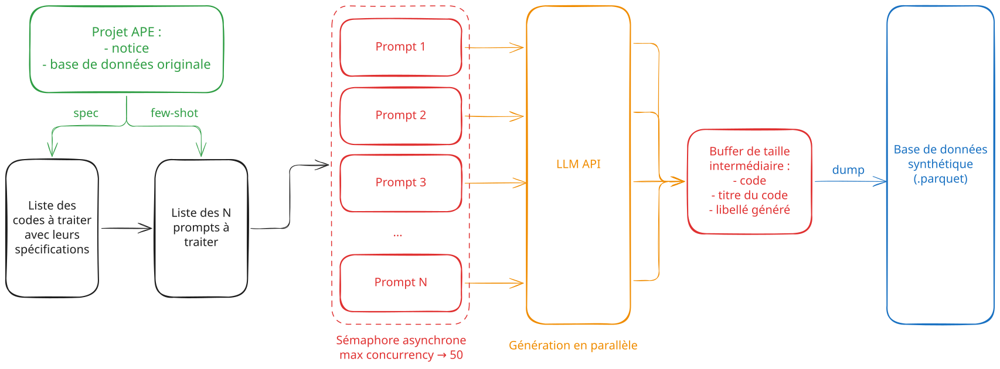
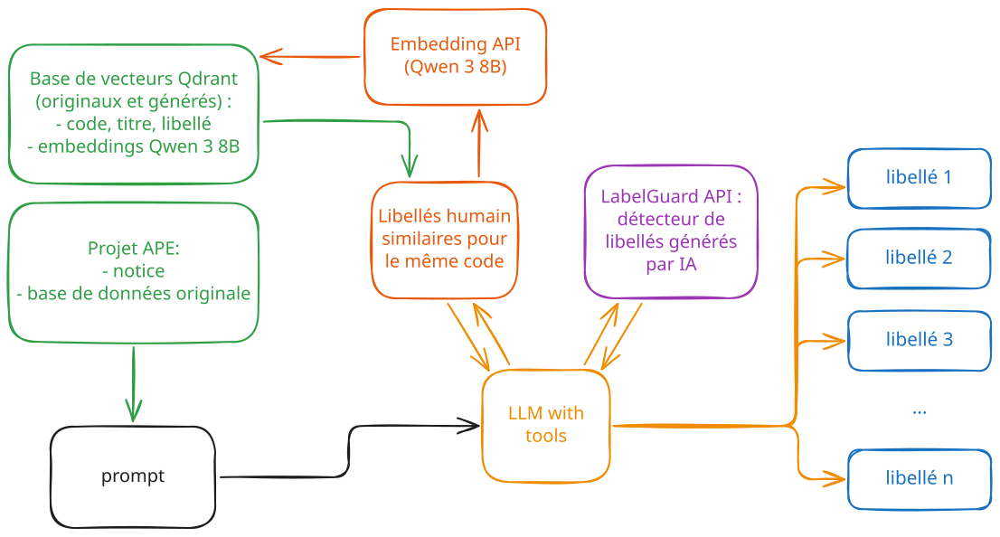
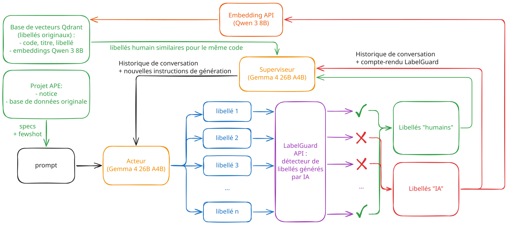

```{=html}
<span class="report-kicker">Rapport de stage</span>
```

**Tuteur de stage :** Meilame Tayebjee, SSP Lab (Insee)

# Abstract {#sec-summary .unnumbered}

La codification automatique des activités économiques dans les nomenclatures statistiques se heurte à un double défi : un déséquilibre extrême des classes et des restrictions strictes liées au secret statistique, qui interdisent la diffusion publique des données réelles des déclarants. Afin d'articuler au mieux la performance des classifieurs et la confidentialité des données, ce travail présente un nouveau cadre de génération de libellés textuels synthétiques par Grands Modèles de Langage (LLM). Nous formalisons d'abord l'existence d'une signature stylistique propre aux LLM en entraînant un discriminateur (`LabelGuard`) qui identifie les textes synthétiques avec une exactitude de $99,4\%$, mettant en évidence un *covariate shift* conditionnel marqué. Pour forcer l'alignement stylistique vers le langage brut des déclarants, nous proposons une architecture agentique de type Acteur-Superviseur pour `Code2Text`. À l'aide d'un protocole d'évaluation par ensembles imbriqués ($\mathcal{M}_\alpha$) appliqué à un corpus de 50 000 données, nous démontrons qu'un taux d'injection optimal de $40\%$ à $50\%$ de données synthétiques améliore significativement l'exactitude du classifieur sur les classes rares tout en préservant les performances sur les classes fréquentes. Néanmoins, l'analyse qualitative révèle des limites structurelles, notamment un taux de fuite de données de $0,5\%$ par recopie textuelle et une capture encore imparfaite du bruit anthropique.

# Préambule {#sec-preambule .unnumbered}

Mon stage s'est déroulé à l'Institut National de la Statistique et des Etudes Economiques (Insee), et plus précisément au sein de son laboratoire d'innovation : le SSP Lab. Très centré autour du traitement automatique du langage, j'ai été amené à travailler sur la génération de données synthétiques textuelles. Ce rapport présente ma démarche, les difficultés rencontrées ainsi que les résultats que j'ai obtenus. Il se termine par un regard critique sur les contributions apportées et sur les perspectives envisagées.

# Remerciements {#sec-remerciements .unnumbered}

Je suis personnellement fier des travaux que j'ai pu réaliser durant cette période de stage, notamment grâce aux personnes autour de moi qui m'ont éclairé et guidé pour mener à bien mon projet. Je tiens donc particulièrement à remercier mon tuteur de stage, Meilame Tayebjee, pour tous ses conseils utiles et son accompagnement régulier. Je remercie également Théo Ferry et Nathan Randriamanana qui ont été d'une aide précieuse pour comprendre l'environnement de travail et le contexte métier. Merci à Romain Lesur et Mélina Hillion de m'avoir accueilli au sein du SSP Lab pour ce stage, et plus généralement à toute l'équipe pour sa bienveillance et pour les différents échanges qui m'ont permis de pousser le projet plus loin. Je tiens enfin à remercier la DIIT (et Cédric !) pour l'aide technique lorsque je n'arrivais plus à utiliser le SSP Cloud : cela m'a sauvé à plusieurs reprises !

# Introduction

### Le défi de la codification automatique de la NAF

**Classer** des textes dans des catégories fixes (appelées nomenclatures) **est essentiel** pour produire des statistiques publiques de qualité. D'un côté, **les chiffres publiés doivent être précis** pour éclairer le débat économique. Prenez l'Indice des Prix à la Consommation (IPC) qui mesure l'inflation, celui-ci utilise la nomenclature internationale COICOP [@inseecoicop] pour donner le bon poids à chaque type de dépense des ménages. D'un autre côté, respecter ces catégories est souvent une **obligation légale** : chaque pays de l'Union européenne doit classer l'activité économique de ses entreprises selon la Nomenclature statistique des Activités économiques dans la Communauté Européenne (NACE) [@statbelnace].

En pratique, appliquer ce système à l'échelle d'un pays pose de gros **problèmes industriels**. Il faut d'abord créer un guide très précis (la notice de codification), puis être capable de gérer un flux massif de données. En France, la version nationale de la NACE s'appelle la Nomenclature d'Activité Française (NAF). Elle impose d'associer chaque année des millions d'établissements d'entreprise à l'un des 747 codes existants. À l'origine, ce travail était fait par des agents administratifs qui lisaient la description textuelle écrite par les créateurs d'entreprises. Mais face à ce volume énorme, **il est devenu indispensable d'automatiser** le processus avec des méthodes de traitement automatique du langage (*Natural Language Processing*, NLP) pour aider les agents et limiter les erreurs.

### Déséquilibre extrême et limites du secret statistique

Pour entraîner un classifieur de type *Text2Code* (du texte vers le code), on se heurte à un problème classique en IA : le **déséquilibre extrême des classes** (*long-tail classification*). Les données réelles ne couvrent pas toutes les catégories de la même manière. Les activités courantes saturent le début de la distribution, tandis que la majorité des codes de la nomenclature se situent dans la "queue de distribution", où il n'y a presque aucun exemple.

Les chiffres de la NAF 2025 montrent bien ce déséquilibre : sur un fichier d'entraînement de **plus d'un million de libellés réels**, **un code sur deux comprend moins de 60 exemples**. À cause de cette rareté, les modèles supervisés classiques ne parviennent pas à apprendre ces catégories, ce qui crée des erreurs importantes lors de la mise en production.

À cela s'ajoutent deux contraintes :

1. Quand une nomenclature est **mise à jour** ou que les **tendances changent** dans les créations d'entreprise, cela crée un décalage immédiat (*distribution shift*) entre les données passées et les nouvelles données réelles. Un bon exemple est la popularité récente des logements meublés non professionnels (LMNP) qui a fait grimper le nombre de codes `68.20G`, anciennement `68.20A` (NAF 2008).
2. La loi sur le **secret statistique** et le RGPD interdisent de diffuser ces vrais fichiers à des personnes extérieures (pour des cours, des hackathons ou des concours d'écoles). Ce manque de données ouvertes empêche la communauté scientifique de tester de nouveaux modèles sur ces sujets et donc de contribuer à des progrès technologiques. Cette contrainte n'est **techniquement pas présente ici**, mais intervenient pour d'autres cas d'usage.


### Tension entre performance de classification et fidélité de diffusion

Le système de codification automatique utilisé depuis novembre 2022 à l'Insee repose sur **FastText** [@bojanowski2017enriching]. S'il permet de traiter seul environ 70 % des cas les plus simples, ce modèle **n'est plus à jour face aux architectures modernes** de l'état de l'art, comme les transformeurs légers [@sanh2019distilbert] ou les encodeurs denses [@reimers2019sentence], qui offrent de bien meilleures capacités de compréhension contextuelle. De plus, les retours métiers des experts de la nomenclature mettent régulièrement en évidence des erreurs de prédiction de ce classifieur. Une voie majeure pour franchir un cap en performance réside dans l'**augmentation du jeu de données d'entraînement par l'injection de données synthétiques** issues de grands modèles de langage (LLM).

Cependant, l'introduction de ces données synthétiques au sein d'un flux de production réel soulève des défis théoriques profonds. En s'appuyant sur le cadre de référence du décalage de données (*dataset shift*) théorisé par @quinonero2008dataset, notre cas d'étude est confronté à **trois mécanismes potentitels de décalage de la loi jointe** $P(X, Y)$ (où $X$ représente le libellé textuel et $Y$ le code de la nomenclature) :

1. **Le *prior probability shift* :** Il intervient lorsque **la distribution des classes $P(Y)$ est modifiée**. La nomenclature réelle présente une distribution très déséquilibrée. Pour aider un classifieur à apprendre les catégories rares, la pratique classique en apprentissage automatique consiste à modifier artificiellement $P(Y)$ (par exemple en augmentant les probabilités des classes rares initiales), créant un *prior shift* volontaire par rapport au flux réel.
2. **Le *covariate shift* :** Il apparaît lorsque **la distribution des variables explicatives $P(X)$ change**. C'est le **risque majeur de la génération synthétique naïve** : un LLM non guidé produit des textes académiques, parfaits et sans défauts. Sa distribution $P_{synth}(X|Y)$ présente un décalage de domaine critique par rapport au style empirique des déclarants humains $P_{real}(X|Y)$ (caractérisé par des fautes, des abréviations et des structures hachées).
3. **Le *concept drift***, théorisé par [@tsymbal2004problem] : Il se traduit par une **modification de la règle de décision** $P(Y|X)$. C'est le point de départ de notre étude, matérialisé par le passage à la nouvelle nomenclature NAF 2025. Un même libellé textuel peut changer de catégorie légale par rapport aux années précédentes. Dans notre cas, ce shift est documenté et encadré par la notice officielle.

La tension de notre travail réside dans le fait que la création d'un jeu de données optimisé pour l'apprentissage d'un classifieur ne coïncide pas naturellement avec celle d'un jeu de données destiné à la diffusion publique (*open-data*). L'objectif de diffusion pure exige de mimer fidèlement la distribution $P(X)$ réelle qui contient des libellés hors-sujets (valeurs aberrantes) et demande la même distribution $P(Y)$, alors que l'optimisation du classifieur demande une stratégie inverse sur $P(Y)$ et un contrôle strict de la pertinence du bruit textuel injecté.

### Approche proposée et contributions

Pour articuler ces objectifs sans qu'ils ne se nuisent, nous proposons de **découpler la structure de la nomenclature de l'expression humaine en utilisant le LLM pour réduire le *covariate shift* au niveau conditionnel, c'est-à-dire pour chaque code $Y$**.

Notre approche consiste à guider le processus de génération pour que la distribution conditionnelle synthétique $P_{synth}(X | Y)$ converge vers la distribution humaine $P_{real}(X | Y)$. Plutôt que de laisser le LLM dériver vers son style académique naturel, nous lui apprenons à transférer le style et la texture sémantique des déclarants (abréviations, syntaxe métier brute) sur la base des concepts immuables de la notice. Une fois ce générateur conditionnel robuste obtenu, la dualité des cas d'usage se résout par simple manipulation de la loi d'échantillonnage des codes $P(Y)$ en entrée du pipeline : le *prior probability shift* est ainsi annulé pour le scénario de diffusion open-data, ou volontairement exploité (distribution uniforme) pour maximiser les performances du classifieur aval sur la queue de distribution.

Les contributions principales de ce travail sont :

* **La création de `LabelGuard` :** Un discriminateur capable de détecter le *covariate shift* entre les styles employés par le LLM et l'humain, mettant en évidence l'empreinte (*watermark*) laissée par les modèles de langage dans l'espace des plongements vectoriels.
* **L'architecture `Code2ReText` :** Un framework agentique à deux LLM (Générateur-Superviseur) qui utilise le signal de `LabelGuard` pour forcer l'alignement stylistique et réduire le *covariate shift* conditionnel.
* **Une évaluation par ensembles imbriqués (protocole $\mathcal{M}_\alpha$) :** Une analyse fine de l'influence de la proportion de données synthétiques sur le classifieur `Text2Code`, isolant les gains spécifiques sur les classes de faible fréquence et identifiant le point de saturation synthétique.
* **Un pipeline reproductible :** Un code entièrement open source et agnostique, conçu pour être immédiatement transposable à d'autres nomenclatures hiérarchiques (comme la NACE européenne).

Le reste de ce rapport est structuré ainsi. La Section 2 présente l'état de l'art de la génération de données en NLP. La Section 3 détaille la donnée utilisée, et la section 4 introduit un premier générateur : `NaiveCode2Text`. La section 5 aborde le fonctionnement de `LabelGuard`, base pour la section 6 sur `Code2ReText`. La Section 7 décrit les méthodes d'évaluation, dont les résultats sont présenté section 8. Le rapport se termine par une conclusion et présente des perspectives de travail.


# État de l'Art

## Augmentation de données textuelles par des modèles de langage

**Avant l'avènement des grands modèles de langage** (LLMs), l'augmentation de données textuelles en NLP reposait principalement sur des règles de transformation de surface ou des substitutions locales. Les approches traditionnelles exploitent des **perturbations syntaxiques**, du **remplacement lexical basé sur des thésaurus** comme WordNet, ou des techniques de **traduction aller-retour** (*back-translation*) [@shorten2021]. Bien que ces méthodes permettent d'accroître artificiellement le volume du corpus d'entraînement, elles souffrent d'une forte rigidité sémantique : elles **se contentent de reformuler les structures existantes** sans introduire de nouveaux concepts ni enrichir le vocabulaire métier.

**L'introduction LLMs** a transformé ce domaine en permettant une génération de données textuelles sensible au contexte. L'approche la plus courante repose sur l'**apprentissage en contexte** (*in-context learning*) via des techniques de *few-shot prompting* [@brown2020]. Dans ce cadre, le modèle reçoit une poignée d'exemples issus du jeu de données réel pour assimiler le style, la structure et le ton des libellés cibles. Des frameworks plus avancés incitent le LLM à générer des variations textuelles en introduisant des contraintes de diversité sémantique ou linguistique directement dans le prompt [@schick2021].

Une étape fondatrice dans la génération de données textuelle est **Self-Instruct** proposé par @wang2023self. L'idée consiste à utiliser un LLM pour **générer automatiquement des paires instruction-réponse qui serviront ensuite à entraîner ou spécialiser un autre modèle**. Cette approche a démontré qu'un système pouvait améliorer ses performances à partir de données qu'il avait lui-même contribué à produire.

Néanmoins, qu'elles soient basées sur des règles heuristiques ou sur du *few-shot prompting*, ces méthodologies partagent une limite fondamentale : **la donnée générée demeure intrinsèquement bornée par le périmètre informationnel du jeu de données d'origine**. En l'absence d'un référentiel externe, le modèle ne fait que cloner, interpoler ou reformuler des concepts déjà présents dans l'échantillon initial. Il est incapable d'explorer des thématiques absentes ou sous-représentées, ce qui expose le système au risque de propager, voire d'amplifier, les biais de sélection de la base de données source.

## Génération synthétique pilotée par connaissances externes

Pour s'affranchir de la dépendance aux données historiques, plusieurs travaux explorent l'**injection de connaissances structurées exogènes** au sein des architectures génératives, un domaine désigné sous le terme de génération guidée par taxonomie (*taxonomy-guided generation*). Dans notre cadre applicatif, la présence d'une notice officielle constitue une ressource documentaire exhaustive et immuable, qui fournit pour chaque catégorie son code, son titre, ainsi que ses critères d'inclusion et d'exclusion.

**Historiquement**, l'intégration de telles connaissances nécessitait le développement d'**architectures dédiées**. Par exemple, @chen2020kgpt introduisent le framework KGPT, qui repose sur un pré-entraînement lourd et spécifique pour aligner des structures de données (graphes de connaissances) avec du texte. Cette stratégie s'avère plus **coûteuse** à mettre en œuvre que les LLMs actuels, et donc moins adaptée à notre cas d'usage.

**L'apparition des grands modèles de langage a favorisé une approche plus flexible** fondée sur la récupération d'information (*retrieval*). Dans les systèmes de *Retrieval-Augmented Generation* (RAG), introduits par @lewis2020retrieval, le modèle ne s'appuie plus uniquement sur ses connaissances paramétriques : il consulte d'abord une source documentaire externe avant de produire sa réponse. Cette stratégie permet d'améliorer la factualité des contenus générés tout en facilitant l'adaptation à des domaines spécialisés.

Dans le cadre de la génération de données synthétiques, des travaux récents montrent que **l'utilisation de documents récupérés dynamiquement améliore la pertinence et la diversité des exemples produits**. Les informations externes peuvent être injectées sous différentes formes : passages textuels, exemples similaires retrouvés dans un espace d'embedding, taxonomies hiérarchiques ou bases de connaissances structurées [@long2024llms].

Notre cas d'étude présente une situation particulièrement favorable à ce type de méthode. Contrairement à de nombreux contextes applicatifs où les connaissances doivent être recherchées dans de larges corpus, **l'ensemble de l'information pertinente peut être injecté directement dans la fenêtre de contexte du modèle**. Notre approche peut ainsi être interprétée comme une forme spécialisée de génération augmentée par récupération, où la notice joue le rôle de source documentaire de référence. L'objectif n'est cependant pas la production d'une réponse à une question utilisateur, mais la génération de libellés synthétiques destinés à l'entraînement d'un classifieur Text2Code. **La qualité du système dépend alors de sa capacité à transformer cette connaissance normative en formulations proches du langage réellement employé par les déclarants**.

## Transfert de style

L'utilisation exclusive de la notice comme source d'inspiration introduit un **biais stylistique**. Par construction, **les LLMs subissent un alignement strict** conçu pour éliminer les erreurs de syntaxe et produire un langage formel, neutre et grammaticalement parfait. Cela peut être dû au *Reinforcement Learning from Human Feedback* (RLHF) [@ouyang2022training], au *Supervised-Fine-Tuning* (SFT) [@zhang2026instruction], où à d'autres facteurs. @reinhart2025do confirment la différence de style avec le langage humain, qui change selon les modèles mais reste toujours présente.

**Ce phénomène crée un *covariate shift*** : comme le prouvent @belinkov2018synthetic, les modèles en NLP ont des difficultés à faire face à du bruit inconnu. Dans notre cas, un classifieur entraîné sur des textes parfaits issus des données synthétiques pourrait donc subir une baisse drastique de ses performances lorsqu'il est confronté au bruit des données originales. Pour corriger ce décalage, **il est nécessaire de recourir au transfert de style** (*style transfer*). @gao2023self montrent qu'un processus de réécriture grâce à une série de dialogues entre LLMs devance le *few-shot prompting* en terme de performances pour les tâches. Pour du transfert de style, cela permettrait de **mimer le comportement des déclarants réels** en introduisant un bruit anthropique ciblé (abréviations métiers, troncatures de mots, fautes d'orthographe de saisie).

## Evaluation

Pour rappel, nous souhaitons que $P_{synth}( \cdot | Y)$ converge vers $P_{real}( \cdot | Y)$ pour tout code $Y$ de sorte à atteindre le double objectif d'amélioration des performances du classifieur Text2Code et de diffusion des données. Plusieurs méthodes d'évaluation s'offrent à nous.

Pour la partie performances, le protocole ***Train on Synthetic, Test on Real*** (TSTR), formalisé par @esteban2017real, est très adapté. L'idée est d'entraîner le classifieur uniquement sur la donnée synthétique, et d'évaluer uniquement sur la donnée originale.

Pour quantifier la réduction du *covariate shift*, une solution est d'**utiliser des discriminateurs** entraînés à distinguer les productions humaines des productions synthétiques [@bowman2016generating]. Dans ce cadre d'évaluation antagoniste, l'exactitude du discriminateur sert de proxy pour mesurer la convergence stylistique : une baisse de sa capacité de détection indique que le générateur parvient à effacer sa signature pour s'aligner sur la sémantique humaine. 

Plus généralement, des **métriques de similarités** entre des données textuelles existent. De simples comparaisons entre les mots employés comme avec le *Jaccard Similarity Index* [@travieso2024analytical], jusqu'à l'*Integrated Maximum Mean Discrepancy* (IMMD) [@ding2025testing], plein de métriques permettent de comparer deux corpus de textes --- ici, données synthétiques et données réelles pour un même code. La limite de ces approches réside dans l'**incapacité à mesurer la créativité des données synthétiques**, ce que l'on cherche pourtant si on veut améliorer la classification ou diffuser des données qui ne soient pas des copies propres des données originales. C'est pourquoi ces métriques seront moins mises en valeurs face aux deux premières.


# La donnée disponible {#sec-data}

Pour rappel, **l'étude se concentre sur le cas de la NAF 2025**, mais la **structure des données utilisées est très similaire à d'autres nomenclatures** et donc appliquable dans d'autres cas, tant qu'il y a bien une notice exhaustive.

## La notice de la nomenclature

La notice NAF 2025 a une **structure hiérarchique sur cinq niveaux emboîtés**. Elle est composée de 21 sections, 87 divisions, 287 groupes, 651 classes et 747 sous-classes, de sorte à partager des points communs avec les nomenclatures européennes et internationales d'activités d'entreprise [@insee2025naf]. On peut retrouver tous les détails sous forme de tableau dans un fichier `.xlsx` avec les **attributs suivants** pour chaque catégorie :

- **Code** : chaîne de caractère courte **unique à chaque catégorie**, dont l'écriture conserve l'aspect hiérarchique.
-	**Titre**	: nom décrivant la catégorie.
- **Code du parent** : code de la catégorie de niveau supérieur (si elle existe).
- **Niveau** : niveau de hiérarchie de la catégorie (de 1 à 5 ici).
- **Includes** : tous les éléments inclus dans la catégorie.
- **IncludesAlso** : d'autres éléments inclus dans la catégorie.
- **Excludes** : tous les éléments exclus de la catégorie, mais qui ressemblent à ceux inclus.

D'autres éléments peuvent être présents mais sont redondants par rapport aux informations indiquées ci-dessus. Un exemple de notice détaillée se trouve en annexe.

**On notera $\mathcal{Y}$ l'ensemble des codes (uniques) des sous-classes de la NAF 2025**. On a $|\mathcal{Y}| = 747$. Par simplicité, en dehors de cette sous-partie, le mot code dans le rapport désigne un code dans $\mathcal{Y}$.
 
## Défis de la donnée originale

Le choix de la NAF 2025 n'est pas anodin dans notre cas. En plus de comporter une notice exhaustive sans aucun attribut vide, la base de données originale est **très large** et **déjà travaillée dans d'autres projets** en science des données à l'Insee.

La donnée originale provient de formulaires remplis pour la création ou de modification d'établissements d'entreprise (création d'un nouveau SIRET) entre le 8 novembre 2022 et 27 octobre 2024. Chaque ligne est composée d'un **libellé**, d'un **code** associé, et de variables catégorielles supplémentaires (que l'on n'utilisera pas ici). Elle est divisée en trois grands groupes indépendants :

- $\mathcal{X}_{train\_real}$ ($\approx 1\,500\,000$ lignes) : pour l'**entraînement de modèles** et pour la **génération de données**.
- $\mathcal{X}_{val}$ ($\approx 400\,000$ lignes) : pour suivre les **performances durant l'entraînement** des codifieurs automatiques. 
- $\mathcal{X}_{test}$ ($\approx 500\,000$ lignes) : pour calculer les **performances finales** des codifieurs après entraînement.

La donnée de travail a certaines particularités qu'il est nécessaire de présenter pour avoir un regard plus critique sur les résultats de cette étude. En effet, parce que c'est la donnée d'entraînement pour *Text2Code* sur la NAF 2025, cette base a subi un traitement qui peut générer un **bruit** dans nos résultats. Trois facteurs principaux altèrent sa qualité :

**Altération artificielle de la distribution à la mi-mai 2026** :

* **Mécanisme** : Duplication de libellés existants pour surreprésenter certaines classes minoritaires et limiter les erreurs de classification du modèle en production.
* **Impact méthodologique** : La première phase des travaux (*NaiveCode2Text* pour le *few-shot* et *LabelGuard* pour l'entraînement) s'est appuyée sur la base initiale $\mathcal{X}_{train\_real}$ ($\approx 800\,000$ lignes), représentative de la distribution réelle. Les travaux ultérieurs ont quant à eux exploité une distribution modifiée artificiellement.


**Biais de transition de nomenclature (NAF 2008 $\rightarrow$ NAF 2025)** :

* **Mécanisme** : Recodage a posteriori des données historiques (période du 8 novembre 2022 au 27 octobre 2024) via un LLM, guidé par la table de correspondance de l'Insee et des consignes d'annotation humaine.
* **Impact méthodologique** : L'incomplétude initiale de la table de passage et la non-exhaustivité des consignes d'alignement au moment de la transition constituent une source potentielle d'erreurs de labellisation systématiques.


**Bruit d'annotation issu du processus de labellisation** :

* **Labellisation algorithmique ($\approx 2/3$ des données)** : Effectuée par un modèle *FastText* (sous condition de dépassement d'un seuil de confiance). Avec une exactitude (*accuracy*) mesurée à un peu moins de $90\%$, cette méthode introduit structurellement environ $10\%$ de bruit sur ce sous-ensemble.
* **Labellisation humaine ($\approx 1/3$ des données)** : Suivie de biais de mesure liés aux contraintes opérationnelles (volume important limitant le temps d'attention par libellé) et conceptuelles (divergences d'interprétation des agents sur les cas limites), un phénomène qualitatif corroboré par la nécessité de fréquentes réunions d'harmonisation.

Si les bruits liés à l'annotation et à la transition de nomenclature sont trop élevés, une solution sera de **s'intéresser au niveau hiérarchique supérieur** (4 au lieu de 5) qui comporte théoriquement moins d'erreurs. En effet, ce niveau 4 est celui de la NACE, plus contrôlé et moins détaillé.

## Distribution des données {#sec-data-distrib}

La distribution des codes est particulière. En ordonnant les codes par leur fréquence, la [@fig-code-log-freq] montre qu'**environ 70 codes constituent la majeure partie de $\mathcal{X}_{train\_real}$**, et que les autres codes suivent une distribution exponentielle selon leur rang. Cette distribution inégale impose des précautions lors de l'analyse de performances générales. 

{#fig-code-log-freq fig-alt="Distribution des codes dans $\mathcal{X}_{train\_real}$, composée d'une tête à très haute fréquence (jusqu'à 10%), d'un corps qui suit une loi exponentielle, et d'une queue sous forme de marches (très faibles proportions) mais avec tendance globale la même équation que le corps."}

Par ailleurs, **les libellés contiennent des anomalies non négligeables**. Les libellés ont été définis avec une **taille maximale de 140 caractères** pour que les partenaires de l'Insee puissent accéder aux données d'entreprises (contraintes du format `XML`). Cela pose deux problèmes.

1. **Beaucoup de libellés identiques tronqués existent.** Le demandeur fait souvent **appel à un mandataire** qui remplit automatiquement pour lui les champs textuels, et a souvent tendance à **copier coller des objets juridiques pour désigner l'activité**. Le soucis est qu'un objet juridique est **très long et donc tronqué**, ce qui le rend imprécis en plus d'être peu pertinent.
2. **Des exceptions de plus de 140 caractères existent.** Le [**Guichet unique**](https://www.inpi.fr/decouvrir-inpi/formalites-dentreprises/guichet-unique-formalites-dentreprises-et-registre-national-entreprises) de l'Institut National de la Propriété Industrielle (INPI) et qui a pour but d'aider aux démarches, **permet à ses agents de créer des libellés de plus que 140 caractères** sans que ceux-ci ne soient tronqués.

Alors, si on s'intéresse à la distribution de la longueur des libellés dans $\mathcal{X}_{real\_train}$, on remarque que **plus de 8% des libellés font exactement 141 ou 161 caractères, ce qui correspond à un troncage suivi d'un espace**, et potentiellement du suffixe "activité de services" (ajout d'une information supplémentaire dans le prétraitement de la donnée). Le code `68.20H` --- qui correspond à la location de biens immobiliers autre que des logements --- est prépondérant parmi les anomalies, et trois quarts des libellés associés à `68.20H` ne sont pas uniques. En s'intéressant aux libellés tronqués les plus récurents, ce sont toujours des objets sociaux tronqués. Des précautions sont donc à prendre pour la suite.

# NaiveCode2Text : Approche initiale pour la génération de données synthétiques {#sec-naivecode2text}

## Environnement informatique disponible

L'environnement de travail de l'Insee permet de profiter de multiples environnements utiles pour le traitement de la donnée grâce à un **cluster Kubernetes**. Notamment, l'ensemble des tâches de stockage et de calcul est réalisé par les machines de l'Insee. Voici une liste non exhaustive des **services utilisés** :

- **Neo4j** (base de données orientée graphe) pour le stockage hiérarchique de la notice ;
- Un **lac de données** (*data lake*), S3-compatible hébergé à l'Insee grâce aux solutions de MinIO, qui répertorie les libellés dans des fichiers au format `.parquet` ;
- **Qdrant** (base de données vectorielles) pour le stockage des embeddings correspondant aux libellés ;
- **Argo Workflow** et **Argo CD** pour l'exécution de longs scripts dans des conteneurs dédiés et la mise en production d'interfaces de programmation d'application (API).
- **vLLM** pour le test de différents LLM sur une NVIDIA H100.

Egalement, nous disposions d'une **API gérée et hébergée par l'Insee qui permet d'intéragir avec des LLMs** branchés à des cartes graphiques NVIDIA H100 (3 au total).

Un schéma récapitulatif interactif est présent [@fig-environnement].

::: {#fig-environnement fig-cap="Architecture de l'environnement informatique disponible"}

<iframe
  src="sources/interactive/environnement_informatique.html"
  class="interactive-figure"
  title="Environnement informatique disponible"
  width="100%"
  height="550px">
</iframe>

:::

## Principe général de NaiveCode2Text

L'approche **NaiveCode2Text constitue la base du projet**. Son principe est simple : **pour chaque code** de la nomenclature, nous extrayons les **informations pertinentes de la notice** (code, titre, quelques éléments *Includes*/*IncludesAlso*, tous les éléments *Excludes*), puis nous les fournissons en contexte au LLM auquel nous demandons de générer un certain nombre de libellés. Nous rajoutons des **exemples de libellés issus du jeu de données original d'entraînement** $\mathcal{X}_{train\_real}$ pour faire du *few-shot learning*.

Pour cette structure de génération, les **facteurs modifiables** sont :

- le **nombre de libellés à générer à chaque appel**,
- le nombre d'éléments ***Includes***,
- le **nombre d'exemples** de libellés,
- les **consignes de génération** dans le *system prompt* (retrouvable en annexe),
- le **modèle de génération** utilisé et sa température, dont les détails sont également présents en annexe.

Pour traiter une nomenclature entière en temps raisonnable, le schéma décrit plus haut a été adapté pour **lancer des requêtes API en parallèle**. Plutôt que d'interroger le modèle successivement pour chaque code, nous envoyons simultanément un lot de requêtes indépendantes de manière asynchrone grâce à un sémaphore avec une concurrence maximale de 50. L'architecture finale est présentée @fig-naive-parallel. 

{#fig-naive-parallel fig-alt="Schéma du pipeline NaiveCode2Text avec requêtes parallèles"}

Une **première génération** comprenant au total **$62\,100$ libellés** a été réalisée en **42 minutes** avec pour idée de recenser tous les cas possibles dans la notice. Alors, tous les 5 éléments *Includes* ou *IncludesAlso* d'un code, au moins 5 appels demandant à chaque fois 10 libellés étaient faits au LLM. 6 exemples *few-shot* de libellés provenant du même code étaient fournis par prompt, sauf pour les codes rares qui ne fournissaient que le maximum d'exemples possibles (voir @sec-data pour la distribution hétérogène).

**Les libellés générés étaient très techniques et satisfaisants d'un point de vue métier** (plus de détails accordés dans @sec-resultats). Cependant, une lecture qualitative rapide faisait déjà apparaître des **tournures de phrases qui changeaient des textes originaux**. Celles-ci étaient trop professionnelles, sans fautes, et parfois proches du titre de la catégorie, par exemple pour le code `02.10Y` correspondant à *Sylviculture et autres activités forestières*, on pouvait trouver *Activités forestières : culture de peupliers et de saules.* Demander des textes moins formels dans le *system prompts* n'y faisant rien, nous avons décidé de créer un discriminateur à la fois comme métrique mais aussi comme outil pour une génération améliorée.


# LabelGuard : discriminateur et évaluateur

**LabelGuard est un discriminateur entraîné pour distinguer les libellés générés par IA des libellés originaux humains**. L'architecture, résumée [@fig-labelguard], prend en entrée un vecteur représentant le libellé (*embedding*) et retourne une valeur entre 0 et 1, 0 signifiant humain, et 1 IA.

::: {#fig-labelguard fig-cap="Architecture de labelguard"}

<iframe
  src="sources/interactive/labelguard.html"
  class="interactive-figure"
  title="Environnement informatique disponible"
  width="100%"
  height="250px">
</iframe>

:::

## Données utilisées

Le jeu de **données d'entraînement** pour LabelGuard a une taille de $160\,000$ libellés, dont $80\,000$ synthétiques et $80\,000$ originaux. Un jeu de données de validation de $40\,000$ textes a également été créé avec une **proportion égale IA/humain**. Pour limiter au mieux l'influence de facteurs extérieurs au style des libellés, plusieurs stratégies ont été employées.

D'abord, la base de données originale provenant de $\mathcal{X}_{real\_train}$ a été pré-traitée comme suit :

1. **Suppression des anomalies** : les libellés comprenant exactement 141 et 161 caractères ont été retirés, car ils sont pour la grande majorité tronqués.
2. **Suppression des marques personnelles** : même si cela n'a pas été décris dans la [@sec-data], certains libellés contiennent des données personnelles. Cela peut être des SIREN ou des codes postaux que l'on ne souhaite pas inclure comme facteur discriminant car marque trop simple pour discriminer. Tous les libellés ayant plus de deux chiffres (sans être un pourcentage) sont donc supprimés.
3. **Suppression des libellés hors-sujet** : certains libellés ne décrivent pas l'activité d'entreprise mais plutôt quelque chose comme "Je souhaite avoir un SIRET au plus vite". Ces phrases tounées personnellement et peu nombreuses ont été supprimées.
4. **Suppression de suffixes** : le suffixe "activité de services" est très utilisé dans les libellés originaux (information supplémentaire ajoutée qui n'apparait pas dans le code initial), il a donc été retiré pour tous les textes l'incluant à la fin.

Après avoir modifié $\mathcal{X}_{real\_train}$, nous avons **échantilloné d'abord 5 libellés par code** avec remise (pour les codes rares notamment), **puis échantilloné le reste des libellés parmi les données restantes** pour atteindre une taille de $100\,000$. Ensuite, la **base de donnée synthétique** $\mathcal{X}_{synth}$ (issue de la génération quasi-uniforme de NaiveCode2Text) a été **échantillonnée avec remise en respectant la distribution des codes originaux** (pour un même code, le même nombre de libellés originaux et synthétiques existent).

Finalement, le jeu de donnée obtenu (de taille $200\,000$) a été divisé dans des proportions $80\%/20\%$ en jeux d'entraînement et de validation. Tous les libellés ont ensuite été transformé en *embeddings* de dimension $4\,096$ avec `Qwen/Qwen3-Embedding-8B`.

## Sélection du modèle optimal

Pour avoir la version de LabelGuard la plus adaptée à notre cas, nous avons cherché à **minimiser le taux de faux-positifs** (*False Positive Rate*, FPR) **tout en préservant une bonne *accuracy*** sur la donnée de validation pour éviter le plus possible de mal classifier les libellés avec le style humain.

Plusieurs modèles ont été essayés avec différents hyperparamètres pour la prédiction : régression logistique, machine à vecteurs de support (SVM) [@cortes1995support], XGBoost [@chen2016xgboost], ou perceptron multicouche (MLP) [@murtagh1991multilayer]. Les configuration sont détaillées en annexe.

De manière générale, **les modèles les plus performants après entraînement étaient de la classe MLP** (en *accuracy* et en FPR). Celui retenu a la configuration suivante :

```{=html}
<div class="stat-row">
  <div class="stat-card">
    <span class="val">Couches</span>
    <span class="lbl"><b>4096</b> → <b>1024</b> (dropout 0,3) → <b>256</b> → <b>1</b></span>
  </div>
  <div class="stat-card">
    <span class="val">Apprentissage</span>
    <span class="lbl"><b>Taux d'apprentissage</b> : 0,001</span>
    <span class="lbl"><b>Optimiseur</b> : Adam</span>
    <span class="lbl"><b>Fonction de coût</b> : BCE avec coût logit</span>
  </div>
</div>
```
Un détail des résultats est retrouvable en annexe.

## Mesure de l'empreinte du LLM : Analyse de la séparabilité des distributions {#sec-labelguard-res}

Un point est particulièrement alarmant pour **LabelGuard** : il **ne se trompe presque jamais**. Pour $40\,000$ libellés de validation, on obtient **$99.4\%$ d'*accuracy* et $0.7\%$ de FPR** --- soit seulement $139$ libellés faux positifs. Ces performances restent du même acabit si on réduit drastiquement le nombre de données d'entraînement, ce qui témoigne que ce n'est pas un simple overfitting du modèle déployé mais bien de la **présence d'une empreinte (*watermark*) propre au LLM** qu'il faut pouvoir identifier.

En s'intéressant au détail des décisions de LabelGuard, la [@fig-labelguard-valid] montre qu'il a une très grande confiance dans presque toutes ses prédictions. Au contraire, le discriminateur est moins décisif dans les cas où il se trompe.

::: {#fig-labelguard-valid layout-ncol=2}

{#fig-labelguard-confidence fig-alt="Deux grands pics de confiance sont présents autour de 0 et de 1 avec une prédiction correcte."}

{#fig-labelguard-missclass fig-alt="Deux petits pics de confiance sont présents autour de 0 et de 1, le reste est distribué uniformément."}

Détails sur la confiance de LabelGuard dans ses prédictions.
:::

Pour ce qui concerne l'**analyse des faux positifs**, nous avons réalisé des **tests de corrélation** (*Pearson correlation coefficient*) pour **plusieurs règles syntaxiques simples** sur les libellés humains. Il s'avère que les attributs suivant ont des corrélations fortement significative avec la discrimination de LabelGuard :

- Pour les **corrélations positives** (libellés humains davantage jugés comme IA): les taux de '.', de chiffres, de mots vides (*stop words*), et la présence de majuscule au début des libellés.
- Pour les **corrélations négatives** (libellé humains davantage jugés comme humain): le nombre de mots, le taux de ',' et celui de majuscules.

Les détails sur les tests effectués sont présents en annexe.


# Code2ReText : changer le style par alignement Acteur-Superviseur

LabelGuard parvient à différencier les libellés humains et ceux générés par IA : nous pouvons donc l'exploiter pour créer un nouveau générateur qui parvient à le tromper. **Code2ReText** a donc été créé avec pour **objectif de lui faire reformuler ses libellés lorsqu'ils sont détectés comme IA par LabelGuard**.

## Framework Double-LLM : Acteur génératif et Superviseur évaluatif

**L'idée initiale de Code2ReText était de fournir simplement au LLM les outils** (*tools*) pour évaluer sa génération, chercher des libellés similaires à ceux qu'il génère, et lui permettre ainsi de reformuler les libellés générés, comme présenté @fig-retext-agentic. Au départ, nous utilisions la bibliothèque `openai-python` [@openaipython2024] pour donner les *tools* et récupérions seulement les libellés finaux. Cependant, nous avons remarqué que **fournir au même agent l'accès presque illimité à un discriminateur lui permettait de tricher et d'outrepasser les consignes**. En effet, dès les premiers essais, il a commencé à concaténer des mots entre eux --- voire à écrire des mots inintelligibles --- et à recopier les libellés validés par le discrimateur pour l'ensemble de sa génération. 

{#fig-retext-agentic fig-alt="Schéma Code2ReText en version agentique"}

Face à cela, nous avons fait deux choix pour Code2ReText :

1. **Prendre plus de contrôle sur le LLM.** Nous avons utilisé LangGraph, un orchestrateur open-source [@langgraph2024] qui offre des fonctionnalités plus avancées dans l'utilisation de *tools* mais surtout dans le suivi.
2. **Passer d'un schéma à un LLM à une paire Acteur/Superviseur.** **L'Acteur est calqué sur le fonctionnement de NaiveCode2Text**, avec la possibilité additionnelle de reformuler ses libellés. **Le Superviseur** quant à lui reçoit à chaque boucle les libellés générés par l'Acteur avec les résultats de LabelGuard et des libellés originaux similaires provenant du même code. Il **émet alors des consignes** pour l'Acteur de sorte à ce qu'il reformule les libellés discriminés (score fourni par LabelGuard supérieur à 0.70) en des libellés dans le style de ceux qui sont passés et/ou des originaux. Pour éviter de recopier les libellés originaux, le Superviseur a pour instruction de ne pas transmettre ceux auxquels il a accès, et l'Acteur ne peut que changer le style des libellés qu'il a générés sans pouvoir modifier le fond. Un maximum de 5 boucles est autorisé. Un schéma récapitulatif est affiché @fig-retext.

{#fig-retext fig-alt="Schéma Code2ReText"}

## Validation de la démarche

En restant sur 10 libellés générés par appel au LLM, nous avons remarqué que peu de textes passaient le test de LabelGuard, et donc le Superviseur pouvait difficilement guider vers des résultats qui marchent. Nous avons donc décidé de passer à 15 libellés générés par appel au LLM.

Au niveau qualitatif, on constate des consignes récurrentes données par le Superviseur, qui mène à des styles plus divers même si empreints d'autres *watermarks* particuliers : la ponctuation est moins présente, les *stop words* presque inexistants, les majuscules plus présentes. Par exemple, pour revenir sur le code correspondant à la sylviculture présenté [@sec-naivecode2text], une des générations est *TRANSPLANTATION ARBRES*, ce qui est beaucoup moins proche du titre du code original recopié initialement. Il est néanmoins à noter que certains libellés restent très proches sémantiquement de la nomenclature.

Quantitativement, plusieurs attributs montrent la réussite de la démarche (voir [@fig-error-rate-evolution]) :

- Le premier retour du Superviseur améliore grandement les performances de l'Acteur.
- Au fur et à mesure des boucles, les générations proposées par l'Acteur sont de moins en moins discriminées en moyenne.
- Au fur et à mesure des boucles, la distribution du taux de discrimination se décale vers 0.

{#fig-error-rate-evolution fig-alt="Voir les commentaires qui détaillent ce qui se passe."}

Additionnellement, bien que certains codes soient plus facilement discriminés que d'autres par LabelGuard, nous n'avons pas réussi à déterminer des *watermarks* propres aux générations de Code2ReText plus présentes dans certaines catégories.

# Protocole d'évaluation globale de la génération

L'évaluation se fait sur plusieurs aspects, du plus au moins important. Elle a pour but à la fois de rendre compte de l'utilité de générer de la donnée synthétique, et de la difficulté d'aligner un LLM sur un style propre à une nomenclature.

## Évaluation des performances d'un classifieur {#sec-classifier-protocol}

L'évaluation des données synthétiques par les performances d'un codificateur automatique se déroule en deux phases successives. Une première phase est dédiée à l'optimisation de l'architecture du classifieur sur les données réelles. Une deuxième phase applique cette configuration optimale pour mesurer l'impact de l'injection progressive de données synthétiques via des structures d'ensembles imbriqués.


### Donnée utilisée

Avant de détailler l'évaluation, voici les données à disposition :

* $\mathcal{D}_{real\_train}$ : un dataset de $N_{train} = 50\,000$ lignes issues exclusivement du jeu d'entraînement original $\mathcal{X}_{real\_train}$. Il a été construit en échantillonant au hasard d'abord une ligne de données par code (soit $|\mathcal{Y}| = 747$ lignes), puis $N_{train} - |\mathcal{Y}|$ lignes dans la base restante.
* $\mathcal{D}_{synth}$ : un dataset de $N_{train}$ lignes issues exclusivement d'un jeu de données synthétiques $\mathcal{X}_{synth}$ construit à partir du jeu d'entraînement original $\mathcal{X}_{real\_train}$. $\mathcal{D}_{synth}$ a été construit en échantillonant au hasard d'abord une ligne de données par code (soit $|\mathcal{Y}| = 747$ lignes), puis $N_{train} - |\mathcal{Y}|$ lignes dans la base restante.
* $\mathcal{D}_{val}$ : un dataset de $N_{val} = 30\,000$ lignes, issu exclusivement du jeu de validation original $\mathcal{X}_{val}$. Il a été construit en échantillonant $N_{val}$ lignes, sans garantire la représentation de tous les codes. 
* $\mathcal{D}_{test}$ : un dataset de $N_{test} = 30\,000$ lignes, issu exclusivement du jeu de test original $\mathcal{X}_{test}$. Il a été construit en échantillonant $N_{test}$ lignes, sans garantire la représentation de tous les codes.

Pour rappel, les jeux de données $\mathcal{X}_{real\_train}$, $\mathcal{X}_{val}$ et $\mathcal{X}_{test}$ sont indépendants. $\mathcal{X}_{synth}$ a été construit à partir de $\mathcal{X}_{real\_train}$. Cela veut donc dire que $\mathcal{D}_{synth}$ comme $\mathcal{D}_{real\_train}$ sont indépendants de $\mathcal{D}_{val}$, et ces trois ensembles sont eux-mêmes indépendants de $\mathcal{D}_{test}$.

### Phase 1 : Sélection de l'architecture et recherche sur grille

Avant d'intégrer des données synthétiques, il convient de définir un **modèle de classification de référence** en identifiant la configuration d'hyperparamètres optimale sur les données réelles.

L'architecture du modèle repose sur un **pipeline de traitement de texte séquentiel** (tokenizer, embedder de texte et classifieur par réseau de neurones profonds) prenant uniquement en entrée le libellé textuel brut ou standardisé. Ce classifieur estime une distribution de probabilité sur les 747 codes de la nomenclature via une fonction *softmax*.

Une **recherche sur grille** (*grid search*) explorant 36 combinaisons d'hyperparamètres est menée en entraînant le modèle sur $\mathcal{D}_{real\_train}$ et en évaluant sa généralisation sur $\mathcal{D}_{val}$. Les dimensions optimisées ainsi que les détails complets de l'architecture et du protocole d'évaluation sont détaillés en [Annexe @sec-annexe-phase1].

**La configuration optimale obtenue**, notée $\theta^* = (d_{emb}^*, \eta^*, t^*)$, **est celle qui maximise les performances globales selon un compromis multicritère** (exactitude, robustesse du Top-k et fiabilité des prédictions confiantes). Ces paramètres $\theta^*$ sont ensuite figés pour servir de point de comparaison absolu lors de la Phase 2.


### Phase 2 : Évaluation quantitative par ensembles imbriqués

Une fois les hyperparamètres optimaux $\theta^*$ fixés, **nous mesurons l'impact de la substitution des données réelles par les données synthétiques**. Pour ce faire, nous initialisons des modèles strictement identiques à l'architecture optimale sélectionnée en Phase 1, mais nous faisons varier la nature de leur environnement d'entraînement.

Nous construisons une suite ordonnée de jeux de données d'entraînement mixtes $\mathcal{M}_{\alpha}$ de taille fixe $N = 50\,000$ lignes, avec $\alpha$ entre 0 (exclus) et 1 (inclus) qui représente le taux d'injection de données synthétiques ($\mathcal{D}_{synth}$) :

$$\mathcal{M}_{\alpha} = \mathcal{C}_{real}(\alpha) \cup \mathcal{C}_{synth}(\alpha)$$

Où $\mathcal{C}_{synth}(\alpha)$ est un sous-ensemble de $\mathcal{D}_{synth}$ de taille $\lfloor \alpha \cdot N \rfloor$, et $\mathcal{C}_{real}(\alpha)$ est un sous-ensemble de $\mathcal{D}_{real\_train}$ de taille $N - \lfloor \alpha \cdot N \rfloor$.

Une contrainte critique de notre approche consiste à immuniser l'apprentissage contre le problème des classes rares ou absentes, tout en garantissant un déterminisme parfait entre les différents taux $\alpha$. Avant tout échantillonnage, $\mathcal{D}_{real\_train}$ et $\mathcal{D}_{synth}$ sont partitionnés en deux sous-structures : la **base immuable** ($\mathcal{B}$), un **bloc fixe de 747 lignes contenant précisément un exemple pour chaque classe de la nomenclature**, et le **réservoir complémentaire** ($\mathcal{R}$), représentant le reste des lignes disponibles, qui sont ensuite mélangées selon une graine aléatoire fixe.

Pour tout taux $\alpha$ différent de 1, le bloc correspondant est assemblé en sélectionnant systématiquement l'intégralité de la base immuable $\mathcal{B}$, complétée par les premières lignes du réservoir complémentaire $\mathcal{R}$. Cette formulation garantit deux propriétés :

* **Couverture à 100%** : Quel que soit le taux d'injection $\alpha$, le classifieur est exposé à au moins un exemple de chacune des 747 classes lors de l'apprentissage.
* **Inclusion stricte** : Pour deux taux $\alpha_1 < \alpha_2$, l'ensemble des données synthétiques utilisées à la première étape est strictement inclus dans celui de la seconde. Réciproquement, pour les données réelles, l'ensemble à $\alpha_2$ est strictement inclus dans celui à $\alpha_1$. Cette monotonie élimine les biais de variance liés à l'échantillonnage aléatoire pur entre les configurations expérimentales.

Pour un taux $\alpha$ égal à 1, on n'entraîne que sur la donnée synthétique. On garde la notion d'imbrication des ensembles synthétiques injectés $\left(\forall \alpha \in (0,1), \mathcal{C}_{synth}(\alpha) \subset \mathcal{C}_{synth}(1)\right)$, mais on perd la base immuable $\mathcal{B}_{real}$ de la donnée originale.

On ne réalise pas d'expérience où $\alpha$ est trop proche de 0 ou de 1, et où donc on ne peut avoir une base immuable dans la donnée originale et dans la donnée synthétique. Sachant que $N_{train} = 50\,000$, cela correspond aux valeurs admises $\alpha \in [0,015, 0,985] \cup \{1\}$.

**L'évaluation des performances de la donnée synthétique consistera alors à étudier les mêmes métriques qu'à la phase 1, mais avec différentes proportions $\alpha$ de données synthétiques**. On s'intéressera par ailleurs à quelques métriques sur les données d'entraînement $\mathcal{M}_{\alpha}$ qui apportent un regard différent sur les données injectées.


## Evaluation sémantique

### Divergence de style

Pour évaluer la divergence stylistique pour chaque code, le choix du **transport optimal** via la distance de Wasserstein à l'ordre 2 ($W_2$) s'avère plus pertinente que les approches basées sur l'information comme la divergence de Kullback-Leibler (KL). Fondée sur la géométrie de l'espace latent sous-jacent, la métrique $W_2$ quantifie l'effort minimal nécessaire pour transformer une distribution de points en une autre [@mroueh2019wasserstein]. Cette propriété permet de travailler directement sur des **nuages de points empiriques discrets**, s'affranchissant des contraintes de la KL qui exige l'estimation de fonctions de densité continues [@kusner2015word]. De plus, l'estimation des **matrices de covariance à grande dimension requise par la KL s'avère hautement instable** sur des échantillons réduits [@bai2011estimating], comme nous avons ici avec des dimensions de 4096 face à des groupes de taille 100 en moyenne. Enfin, là où la KL échoue et diverge vers l'infini face à des styles disjoints ou orthogonaux, la distance $W_2$ conserve des gradients stables et informatifs [@arjovsky2017wasserstein], ce qui **permet de capturer fidèlement les variations de structure fine et de dispersion des styles**, même avec peu de données.

En parallèle, pour s'assurer que la convergence n'est pas trop forte au détriment de la **diversité** dans le style, nous utiliserons le **DC-Score** [@zhu2025measuring]. C'est une métrique conçue justement pour évaluer la diversité dans les corpus synthétiques en se reposant sur la similarité entre ses différents éléments. Nous pouvons donc l'appliquer pour les libellés au sein d'un même code.

Toutes ces comparaisons doivent pouvoir se faire avec un minimum de libellés de chaque côté. Nous avons donc fait le choix de ne **regarder ces métriques que pour les codes où le jeu d'entraînement (plus large) a plus de 50 occurences** (373 sur 747).


# Résultats {#sec-resultats}

Finalement, nous avons 3 jeux de données synthétiques à disposition que nous souhaitons comparer :

1. La génération de **NaiveCode2Text**, **exhaustive**, où la ditribution des codes est presque uniforme (la majorité des codes ont entre 50 et 100 occurences) ;
2. La génération de **Code2ReText**, **exhaustive**, où la ditribution des codes est presque uniforme (la majorité des codes ont entre 50 et 100 occurences) ;
3. La génération de **Code2ReText**, exhaustive, mais où la **distribution des codes est proche de la distribution originale**, avec un minimum de 5 libellés par code.

Les évaluations de performance du classifieur se baseront sur les 3 jeux de données, tandis que celui sur la diversité lexicale se contera de traiter des deux premiers, qui proposent plus d'exemples par code.

## Performances du classifieur et analyse du point de saturation synthétique

Prenons d'abord un point de vue général sur les performances du classifieur (voir [@sec-classifier-protocol] pour le protocole). **Que l'on se place au niveau hiérarchique 4 ou 5, les évolutions de performances gardent la même allure** : on restera donc au niveau 5 pour l'ensemble des métriques.

La [@fig-lvl5-acc-top1-ev] montre que le codificateur automatique conserve de bonnes performances même lorsque 50% du jeu de données d'entraînement est synthétique. Néamoins, un effondrement des performances arrive pour $\alpha \geq 0.9$. Nous remarquons alors que **mimer la distribution originale favorise les meilleures performances** lorsque la donnée originale se fait rare, et que lorsqu'aucune donnée orginale n'est présente en entraînement, NaiveCode2Text offre une génération moins pertinente que Code2ReText. Ces performances sont similaires si on s'intéresse à la prédiction top 5 (au lieu de top 1).

{#fig-lvl5-acc-top1-ev fig-alt="Très légère décroissance avant $\alpha = 0.6$ (*accuracy* au-dessus de 80%), plus marquée jusqu'à $\alpha = 0.9$, puis effondrement après. La génération naïve est la moins bonne et atteint presque 45% d'*accuracy* pour $\alpha = 1$"}

Additionnellement, le modèle subit le **même effondrement pour la confiance dans ses prédiction** : de moins en moins de libellés sont classés avec confiance, et l'*accuracy* parmi les libellés classés avec confiance chute également. Néanmoins, **le jeu de données généré par NaiveCode2Text domine celui de Code2ReText à ditribution de codes égale**. Nous pouvons supposer que du bruit se glisse davantage dans le second cas, ce qui détériore la qualité du signal pour le classifieur.

## Évaluation granulaire : Gains de performance par fréquence du code

Faisons une étude similaire, mais cette fois-ci en **différenciant les performances selon la fréquence des codes**. En les divisant dans les trois groupes de distribution tête/corps/queue présentés [@sec-data-distrib], nous découvrons des propriétés qui mettent en avant une nouvelle fonction des données synthétiques.

De ce fait, alors que les **performances pour la tête sont très similaires au performances générales**, celles pour **le corps et la queue dévient fortement** :

- Pour ce qui est du **corps**, la [@fig-lvl5-body-acc-top1-ev] montre une décroissance de l'*accuracy* avec une tendance linéaire plus marquée que précédemment, sauf au départ où on constate une légère augmentation. Le corps est **très négativement touché par les hautes proportions de données synthétiques**.

{#fig-lvl5-body-acc-top1-ev fig-alt="Légère augmentation initiale (pour $\alpha$ entre 0 et 0.1), puis décroissance de l'*accuracy* quasi linéaire (de 0.58 à 0.50 environ), tout dataset confondu."}

- Pour la **queue**, la [@fig-lvl5-tail-acc-top1-ev] montre au contraire une amélioration très marquée des performances dès les premières injections de données synthétiques, et encopre plus lorsqu'elles sont issues de Code2ReText.

{#fig-lvl5-tail-acc-top1-ev fig-alt="Augmentation avec une tendance concave de l'*accuracy* en fonction de $\alpha$, de 0.1 à 0.7 pour Code2ReText, et 0.45 pour NaiveCode2Text"}

Il y a donc un **grand avantage** à utiliser des données synthétiques : **cela discrimine moins les classes les moins fréquentes**. Pour aller plus loin, nous pouvons déterminer (graphiquement) une proportion optimale de données synthétiques à injecter pour faire un compromis entre performances et égalité de traitement. En s'aidant de la [@fig-lvl5-head-acc-top1-body-acc-top1] et de la [@fig-lvl5-head-acc-top1-tail-acc-top1], on remarque qu'**avoir $\alpha$ entre 40% et 50% nuit peu à l'*accuracy* de la tête et du corps, mais augmente fortement celle de la queue**. On peut donc retenir cette valeur, et privilégier une **génération de type Code2ReText proche de la distribution originale**.

{#fig-lvl5-head-acc-top1-body-acc-top1 fig-alt="Tendance croissante convexe générale, maximum atteint des deux côtés pour $\alpha = 0$"}

{#fig-lvl5-head-acc-top1-tail-acc-top1 fig-alt="Tendance décroissante concave générale, compromis autour de $\alpha = 0.4$ (87%/60%)"}

## Évaluation intrinsèque des datasets : Diversité lexicale et convergence stylistique

Le dernier volet d'évaluation se concentre sur le style de génération. A l'aide d'embeddings, nous reprenons les travaux faits sur la distance de Wasserstein et sur le DC Score pour évaluer la proximité stylistique avec la donnée originale et la diversité intrinsèque pour chaque code.

En ce qui concerne le point de vue du transport optimal, **pour presque tous les codes, Code2ReText est plus proche du style original que NaiveCode2Text**. La [@fig-w2-scatter-plot-train] et un t-test bayésien apparié ($BF10 \approx 1e+58$, $d \approx 0.88$) montrent que la génération de Code2ReText a une distance $W_2$ à $\mathcal{X}_{train\_real}$ plus petite que NaiveCode2Text, que ce soit pour chaque code ou de manière générale.

{#fig-w2-scatter-plot-train fig-alt="Une ligne identité est tracée, presque tous les points se situent sous la courbe, ce qui signifie que la distance $W_2$ est plus faible pour presque tous les codes pour Code2ReText."}

Cependant, la [@fig-dcscore-violin] et un t-test bayésien apparié ($BF10 \approx 1e+71$, $d \approx 1.20$) montrent que ce **rapprochement sémantique a une influence négative sur la diversité des libellés** : le DC-Score s'effondre uniquement pour les générations de Code2ReText, alors que NaiveCode2Text obtient au contraire une diversité un peu plus élevée en moyenne que la distribution originale. Cela signifie donc que l'**on ne peut allier rapprochement stylistique et diversité sémantique avec l'approche proposée ici**.

{#fig-dcscore-violin fig-alt="DC-Score similaire pour NaiveCode2Text et original, plus faible pour Code2ReText."}

Prenons une dernière approche, cette fois-ci qualitative, pour comparer les générations. Voici sept exemples de génération tirés au hasard : 

| Code | Title | NaiveCode2Text | Code2ReText |
| :- | :--- | :--- | :--- |
| **10.71H** | Fabrication de pain et d'autres produits de boulangerie-pâtisserie associée à leur vente au détail | Boulangerie artisanale, offre de produits frais. | Boulangerie pâtisserie viennoiserie |
| **13.95Y** | Fabrication de textiles non-tissés et articles non-tissés | Enduction de textiles non-tissés. | Fabrication de textiles non-tissés et articles non-tissés |
| **26.11Y** | Fabrication de composants électroniques | Production de cellules photovoltaïques pour applications variées. | Fabrication de condensateurs et de composants passifs pour l'industrie |
| **28.95Y** | Fabrication de machines pour les industries du papier et du carton | Machines complètes pour industries du papier. | Fabrication de machines pour les industries du papier et du carton |
| **43.50Y** | Travaux de construction spécialisés en génie civil | Construction d’ouvrages d'art complexe. | MONTAGE STRUCTURES METALLIQUES POUR GENIE CIVIL |
| **46.84H** | Commerce de gros de fournitures pour plomberie et chauffage | Commerce interentreprises de matériel de chauffage industriel. | Plomberie chauffage |
| **70.20Y** | Activités de conseil pour les affaires et autre conseil de gestion | Prestation de services de conseil en organisation | CONSEIL GESTION |

Nous pouvons différencier les deux méthodes : NaiveCode2Text garde un ton très professionnel et s'éloigne peu de la consigne initiale, tandis que **Code2ReText** propose des libellés très différents et **se retrouve parfois à copier le titre du code**, ce qui n'est pas souhaitable. Egalement, on retrouve davantage de libellés qui sont des copiés-collés de libellés originaux (environ 0.5% des données, contre 0.005% pour NaiveCode2Text), ce qui veut dire que **l'Acteur (et potentiellement le Superviseur) ont tendance à tricher pour passer la discrimination de LabelGuard**.


# Conclusion et Travaux Futurs {.unnumbered}

### Objectif initial et synthèse des contributions

L’objectif initial de ce travail était de répondre au défi du **déséquilibre extrême des classes** de la nomenclature NAF 2025 pour l'entraînement de classifieurs automatiques, tout en surmontant les **limites strictes du secret statistique** qui empêchent la diffusion publique des données réelles. Pour articuler la tension entre la performance de classification et la fidélité de diffusion, l'approche proposée a consisté à utiliser des grands modèles de langage (LLM) pour **découpler la structure de la nomenclature de l'expression humaine**, réduisant ainsi le *covariate shift* conditionnel pour chaque code.

Les contributions majeures résident d’abord dans la **mise en évidence d'une empreinte stylistique propre au LLM grâce au discriminateur** `LabelGuard` ($99,4\%$ d'exactitude). Pour forcer l'alignement stylistique du générateur vers le langage brut des déclarants, l’**architecture agentique** `Code2ReText` (Acteur-Superviseur) a été mise en œuvre. Enfin, l'évaluation par ensembles imbriqués (protocole $\mathcal{M}_\alpha$) a permis de valider l'impact de ces données, révélant qu'un **taux d'injection optimal de données synthétiques préserve les performances sur le corps de la distribution tout en augmentant l'exactitude du classifieur sur les classes rares**.

### Limites de l’approche actuelle

Plusieurs limites structurelles invitent toutefois à un regard critique sur ces résultats. Premièrement, **la base de données originale comporte un bruit d’annotation important** issu des labellisations algorithmiques et des biais de transition de nomenclature, ce qui altère la qualité des exemples fournis au modèle. Deuxièmement, l’étude empirique de performance s’est limitée à un volume de 50 000 données, ce qui soulève une **incertitude quant à la généralisation de ces résultats lors d'un passage à l'échelle** industrielle sur plus d’un million de lignes.

De plus, l'analyse qualitative montre que `Code2ReText` recopie textuellement certains libellés originaux dans $0,5\%$ des cas (contre une fraction infime pour `NaiveCode2Text`). Négliger ce phénomène pourrait poser de graves **problèmes de fuite de données** et compromettre l'objectif de diffusion publique anonymisée. Enfin, bien que le pipeline agentique soit parvenu à altérer l'empreinte initiale du LLM, le style obtenu n’est toujours pas parfaitement identique à celui des déclarants réels, laissant une **marge d'amélioration pour capturer fidèlement le "bruit anthropique" humain**.

### Perspectives : du Prompting Agentique au SFT Multilingue

Pour dépasser ces limites, la première solution est d'encadrer davantage l'interaction Acteur/Superviseur en modifiant les prompts et en modifiant l'accès à l'information. Puis, pour s'affranchir des boucles de rétroaction agentiques qui standardisent les corrections, la perspective majeure consiste à passer du prompting à un **Fine-Tuning Supervisé (SFT) stylistique**. Entraîner un modèle open-weight léger à intégrer directement les abréviations, troncatures et fautes de frappe permettrait d'allier fidélité stylistique et créativité sémantique. Cela s'avèrerait plus coûteux que la solution proposée dans ce rapport, mais est à essayer si le besoin augmente.

À terme, cette transition vers le SFT offre une opportunité unique de généralisation. Développé de manière agnostique, le pipeline pourrait intégrer des capacités **multilingues** afin de s'adapter directement à la **Nomenclature européenne des Activités (NACE)**. Le modèle spécialisé serait alors capable de générer des libellés synthétiques typés "déclarants" dans les différentes langues des pays membres du Système Statistique Européen, ouvrant la voie à une harmonisation transfrontalière de la codification automatique tout en respectant le secret statistique.


# Annexe

## Exemple de notice

La version anglaise pour la NACE 2025 est retrouvable en ligne à [cette adresse](https://showvoc.op.europa.eu/#/datasets/ESTAT_Statistical_Classification_of_Economic_Activities_in_the_European_Community_Rev__2_1___NACE_2_1/unknown/downloads), voici une des lignes :

- **Code** : 24.53
-	**Titre**	: Casting of light metals
- **Code du parent** :	24.5
- **Niveau** : 4
- **Includes** : "This class includes:
  - activities of foundries of light metal
  - manufacture of castings made of aluminium
  - manufacture of castings made of magnesium
  - manufacture of castings made of titanium"
- **IncludesAlso** : "This class also includes:
  - casting of dental implements, etc., of light metals"
- **Excludes** : "This class excludes:
  - casting of metals not considered light metals, see 24.51, 24.5"


## Détails sur la génération de texte

La génération de données textuelles a été réalisée grâce à des LLMs. L'Insee détient sa propre infrastructure de calcul, sur laquelle plusieurs modèles *open-weight* sont utilisables. Ces modèles pré-entrainés ont pour particularité d'être téléchargeables en ligne gratuitement (souvent sur HuggingFace) et déployables par n'importe qui à condition d'avoir les ressources nécessaires. Nous avons ainsi utilisé `google/gemma-3-27b-it` [@gemma3] pour NaiveCode2Text.

Il est à savoir que d'autres modèles --- par exemple `openai/gpt-oss-120b` [@openai2025gptoss] --- ont été testés initialement. Les différences entre les LLMs n'étant pas notables qualitativement, le choix a été de garder le modèle le plus utilisé par les équipes à l'Insee pour deux raisons. Déjà, celles-ci sont les plus susceptibles de reprendre les travaux réalisés, donc autant faciliter la reproductibilité du travail. Aussi, les modèles génératifs Gemma sont devenus agentiques à partir de Gemma 3, permettant des réflexions plus complexes, et surtout l'appel d'outils --- fonction utile par la suite. `google/gemma-4-26b-a4b-it` [@gemma4] est sorti malheureusement peu de temps après la génération de NaiveCode2Text, il ne sera utilisé que pour Code2ReText.


## Benchmark des modèles LabelGuard

Voici les configurations essayées (les bibliothèque python sont indiquées entre parenthèses) :

- **Régression logistique** (`scikit learn`)
- **SVM** (`scikit learn`)
- **XGBoost** (`xgboost`)
- **MLP** (`pytorch-lightning`)

Voici les résultats associés :

::: {.table-responsive .table-sm style="max-height: 400px; overflow-y: auto; overflow-x: auto; font-size: 0.85em;"}
| Modèle | C | max_depth | n_estimators | hidden_layers | dropout_layers | lr | Eval Acc | Eval F1 | Eval FPR | Train Acc | Train F1 | Train FPR |
| --- | --- | --- | --- | --- | --- | --- | --- | --- | --- | --- | --- | --- |
| **mlp** | - | - | - | `[1024, 512, 256]` | `[0.3, 0.2, 0]` | 0.001 | 0.9937 | 0.9937 | **0.0067** | 0.9990 | 0.9990 | 0.0006 |
| **mlp** | - | - | - | `[1024, 256]` | `[0.3, 0]` | 0.001 | **0.9941** | **0.9941** | 0.0069 | 0.9987 | 0.9987 | 0.0010 |
| **mlp** | - | - | - | `[1024, 512, 256]` | `[0.3, 0.2, 0]` | 0.010 | 0.9907 | 0.9907 | 0.0122 | 0.9963 | 0.9963 | 0.0044 |
| **mlp** | - | - | - | `[1024, 256]` | `[0.3, 0]` | 0.010 | 0.9912 | 0.9912 | 0.0130 | 0.9962 | 0.9963 | 0.0056 |
| **logreg** | 10.0 | - | - | - | - | - | 0.9864 | 0.9864 | 0.0152 | 0.9897 | 0.9897 | 0.0115 |
| **svm** | 1.0 | - | - | - | - | - | 0.9847 | 0.9847 | 0.0160 | 0.9869 | 0.9869 | 0.0135 |
| **xgboost** | - | 6 | 200 | - | - | - | 0.9850 | 0.9850 | 0.0171 | 0.9999 | 0.9999 | 0.0000 |
| **xgboost** | - | 6 | 100 | - | - | - | 0.9786 | 0.9786 | 0.0251 | 0.9965 | 0.9965 | 0.0036 |
| **logreg** | 1.0 | - | - | - | - | - | 0.9706 | 0.9705 | 0.0292 | 0.9736 | 0.9736 | 0.0268 |
| **xgboost** | - | 6 | 200 | - | - | - | 0.9757 | 0.9758 | 0.0302 | 0.9918 | 0.9918 | 0.0092 |
| **svm** | 0.1 | - | - | - | - | - | 0.9638 | 0.9636 | 0.0346 | 0.9657 | 0.9657 | 0.0339 |
| **xgboost** | - | 6 | 50 | - | - | - | 0.9625 | 0.9626 | 0.0438 | 0.9784 | 0.9785 | 0.0259 |
| **xgboost** | - | 6 | 200 | - | - | - | 0.9607 | 0.9608 | 0.0468 | 0.9744 | 0.9745 | 0.0311 |
| **xgboost** | - | 3 | 200 | - | - | - | 0.9602 | 0.9604 | 0.0473 | 0.9693 | 0.9695 | 0.0368 |
| **xgboost** | - | 6 | 100 | - | - | - | 0.9595 | 0.9597 | 0.0494 | 0.9727 | 0.9729 | 0.0333 |
| **logreg** | 0.1 | - | - | - | - | - | 0.9342 | 0.9337 | 0.0612 | 0.9339 | 0.9338 | 0.0640 |
| **xgboost** | - | 6 | 100 | - | - | - | 0.9376 | 0.9380 | 0.0741 | 0.9483 | 0.9489 | 0.0623 |
| **xgboost** | - | 3 | 100 | - | - | - | 0.9348 | 0.9352 | 0.0744 | 0.9412 | 0.9417 | 0.0671 |
| **xgboost** | - | 6 | 50 | - | - | - | 0.9344 | 0.9349 | 0.0781 | 0.9441 | 0.9448 | 0.0669 |
| **xgboost** | - | 3 | 200 | - | - | - | 0.9276 | 0.9279 | 0.0800 | 0.9318 | 0.9323 | 0.0757 |
| **xgboost** | - | 6 | 50 | - | - | - | 0.9128 | 0.9136 | 0.0997 | 0.9202 | 0.9213 | 0.0929 |
| **xgboost** | - | 3 | 50 | - | - | - | 0.9030 | 0.9033 | 0.1043 | 0.9061 | 0.9070 | 0.1028 |
| **xgboost** | - | 3 | 200 | - | - | - | 0.8988 | 0.8992 | 0.1079 | 0.9000 | 0.9008 | 0.1076 |
| **xgboost** | - | 3 | 100 | - | - | - | 0.8980 | 0.8986 | 0.1109 | 0.8999 | 0.9009 | 0.1093 |
| **xgboost** | - | 6 | 200 | - | - | - | 0.8832 | 0.8847 | 0.1334 | 0.8878 | 0.8897 | 0.1277 |
| **xgboost** | - | 6 | 100 | - | - | - | 0.8815 | 0.8834 | 0.1382 | 0.8852 | 0.8874 | 0.1331 |
| **xgboost** | - | 3 | 100 | - | - | - | 0.8655 | 0.8662 | 0.1429 | 0.8664 | 0.8675 | 0.1409 |
| **xgboost** | - | 3 | 50 | - | - | - | 0.8650 | 0.8658 | 0.1444 | 0.8662 | 0.8674 | 0.1426 |
| **xgboost** | - | 6 | 50 | - | - | - | 0.8808 | 0.8838 | 0.1492 | 0.8843 | 0.8876 | 0.1437 |
| **xgboost** | - | 3 | 50 | - | - | - | 0.8313 | 0.8307 | 0.1686 | 0.8346 | 0.8348 | 0.1658 |
| **xgboost** | - | 3 | 200 | - | - | - | 0.7961 | 0.7938 | 0.1958 | 0.7960 | 0.7947 | 0.1969 |
| **xgboost** | - | 3 | 100 | - | - | - | 0.7931 | 0.7911 | 0.2007 | 0.7946 | 0.7937 | 0.2000 |
| **xgboost** | - | 3 | 50 | - | - | - | 0.7984 | 0.8007 | 0.2164 | 0.8006 | 0.8036 | 0.2138 |
:::

## Corrélation d'attributs de texte avec la discrimination LabelGuard

::: {.table-responsive .table-sm style="max-height: 600px; overflow-y: auto; overflow-x: auto; font-size: 0.85em;"}
| Attribut                                     | Corrélation (p-value) |
|----------------------------------------------|-----------------------|
|**Nombre de mots **                           | **-0.0208 (0.0031\*\*\*)**|
|Taux de signes de ponctuation                 | +0.0028 (0.6866)|
|**Taux de '.'**                               | **+0.0440 (0.0000\*\*\*)**|
|**Taux de ','**                               | **-0.0142 (0.0436\*\*)**|
|Taux de ':                                    | +0.0092 (0.1947)|
|Taux de séparateurs ronds ('\|', ';', '- ')   | -0.0037 (0.5998)|
|**Taux de majuscules**                        | **-0.0204 (0.0039\*\*\*)**|
|Commence par une majuscule                    | +0.0118 (0.0938*)|
|**Taux de chiffres**                          | **+0.0191 (0.0067\*\*\*)**|
|**Taux de stopwords**                         | **+0.0236 (0.0008\*\*\*)**|
:::

## Protocole détaillé de la Phase 1 {#sec-annexe-phase1}

### Espace de la recherche sur grille (*Grid Search*)

La recherche a exploré systématiquement les 36 combinaisons issues des variables de configuration suivantes :

* **Dimension de la représentation vectorielle ($d_{emb}$)** : $\{32, 64, 128, 256, 512, 1024\}$. Cette couche projette les jetons textuels dans un espace vectoriel continu préservant la proximité sémantique.
* **Taux d'apprentissage initial ($\eta$)** : $\{10^{-3}, 5 \cdot 10^{-4}, 10^{-4}\}$ sous l'optimiseur Adam.
* **Pré-traitement textuel ($t$)** :
* `True` : Standardisation du texte (passage en minuscules, suppression des accents, de la ponctuation, des espaces redondants et des *stop words*).
* `False` : Conservation du libellé brut.

### Entraînement et régularisation

* **Nombre d'époques maximal** : 15 cycles complets sur la base $\mathcal{D}_{real\_train}$.
* **Prévention du surapprentissage (*Early Stopping*)** : Arrêt anticipé si la perte de validation sur $\mathcal{D}_{val}$ ne s'améliore pas après une patience de 2 époques.

### Critères d'évaluation pour la sélection de $\theta^*$

Les performances finales de chaque combinaison de la grille sont mesurées sur le jeu indépendant $\mathcal{D}_{test}$ selon quatre axes clés :
- l'exactitude (***accuracy***) pour sa prédiction,
- la fréquence à laquelle le bon code apparait dans les **top 3 et 5** de ses propositions,
- le **taux de prédictions confiantes** (score supérieur à $0.70$ pour un code),
- l'***accuracy* des prédictions confiantes**.

### Modèle adopté

Voici le benchmark :

::: {.table-responsive .table-sm style="max-height: 400px; overflow-y: auto; overflow-x: auto; font-size: 0.85em;"}
| Text preprocessing | Embedding dimension | Learning Rate | Test Accuracy - Top 1 | Test Accuracy - Top 5 | Confidence Coverage Rate | Confidence Accuracy |
| --- | --- | --- | --- | --- | --- | --- |
| True | 512 | 0.001 | **0.8504** | 0.9655 | 0.7887 | **0.9371** |
| True | 512 | 0.0005 | 0.8494 | 0.9662 | **0.8321** | 0.924 |
| True | 1024 | 0.0005 | 0.8491 | **0.9665** | 0.792 | 0.9331 |
| True | 256 | 0.001 | 0.8478 | 0.9644 | 0.7859 | 0.9339 |
| True | 256 | 0.0005 | 0.8478 | 0.9644 | 0.7714 | 0.9395 |
| False | 512 | 0.0005 | 0.8475 | 0.9626 | 0.8051 | 0.929 |
| False | 1024 | 0.0005 | 0.8469 | 0.9628 | 0.7999 | 0.9301 |
| False | 256 | 0.0005 | 0.8463 | 0.9632 | 0.763 | 0.9426 |
| False | 512 | 0.001 | 0.8458 | 0.9617 | 0.7777 | 0.9363 |
| False | 1024 | 0.001 | 0.845 | 0.9621 | 0.797 | 0.9265 |
| False | 256 | 0.001 | 0.8434 | 0.9624 | 0.7754 | 0.9372 |
| True | 1024 | 0.0001 | 0.8434 | 0.9665 | 0.7294 | 0.953 |
| True | 1024 | 0.001 | 0.8428 | 0.9661 | 0.814 | 0.9244 |
| True | 128 | 0.001 | 0.8427 | 0.9625 | 0.7415 | 0.9453 |
| False | 128 | 0.001 | 0.8422 | 0.9606 | 0.8126 | 0.9266 |
| False | 1024 | 0.0001 | 0.8417 | 0.9609 | 0.7195 | 0.9487 |
| True | 64 | 0.001 | 0.8394 | 0.9569 | 0.7405 | 0.9453 |
| True | 128 | 0.0005 | 0.8349 | 0.9601 | 0.7379 | 0.9474 |
| True | 512 | 0.0001 | 0.8309 | 0.9555 | 0.7021 | 0.9492 |
| False | 64 | 0.001 | 0.8308 | 0.9553 | 0.7302 | 0.9464 |
| False | 128 | 0.0005 | 0.8285 | 0.9554 | 0.7353 | 0.9456 |
| False | 512 | 0.0001 | 0.8199 | 0.9463 | 0.6771 | 0.9514 |
| True | 64 | 0.0005 | 0.8148 | 0.9437 | 0.6859 | 0.9552 |
| True | 32 | 0.001 | 0.8127 | 0.9373 | 0.7018 | 0.9461 |
| False | 64 | 0.0005 | 0.808 | 0.9324 | 0.6758 | 0.9549 |
| False | 32 | 0.001 | 0.8074 | 0.9356 | 0.6856 | 0.9542 |
| True | 256 | 0.0001 | 0.8015 | 0.9293 | 0.6479 | 0.9526 |
| False | 256 | 0.0001 | 0.7898 | 0.9209 | 0.6259 | 0.9549 |
| True | 32 | 0.0005 | 0.7865 | 0.912 | 0.6561 | 0.9444 |
| False | 32 | 0.0005 | 0.7733 | 0.9055 | 0.6226 | 0.9568 |
| True | 128 | 0.0001 | 0.769 | 0.901 | 0.5692 | 0.9612 |
| False | 128 | 0.0001 | 0.7511 | 0.8823 | 0.5373 | 0.9627 |
| True | 64 | 0.0001 | 0.7071 | 0.85 | 0.3954 | 0.9686 |
| False | 64 | 0.0001 | 0.6807 | 0.8291 | 0.3539 | 0.9716 |
| True | 32 | 0.0001 | 0.5913 | 0.7791 | 0.2181 | 0.9893 |
| False | 32 | 0.0001 | 0.5596 | 0.75 | 0.2116 | 0.9904 |
:::

Finalement, le modèle adopté a les propriétés suivantes :

- $d_{emb}^* = 256$ : une plus grande dimension améliore peu les performances par rapport au risque de sur-apprentissage lorsque nous introduirons des données synthétiques ;
- $\eta^* = 5 \cdot 10^{-4}$ : meilleurs résultats
- $t = True$ : meilleurs résultats


## Prompts de référence

### System prompt du générateur (naïf et acteur)

::: {style="max-height: 400px; overflow-y: auto; overflow-x: auto; font-size: 0.85em;"}
Tu es un outil automatisé de génération de données synthétiques pour nomenclatures administratives françaises.

Tu n'es PAS un assistant conversationnel.

Tu ne poses JAMAIS de questions.

Tu ne demandes JAMAIS de précisions.

Tu reçois un code et une notice. Tu génères des libellés. C'est tout.

Ta mission est de générer des libellés réalistes correspondant STRICTEMENT à un code donné, selon sa notice officielle.


Contraintes obligatoires :

1. Tu dois produire exactement {nb_labels} libellés.

2. Chaque libellé doit :
    - correspondre au titre et aux domaines inclus
    - respecter les critères définis dans la notice
    - ne jamais relever des domaines exclus

3. Les libellés doivent être :
    - variés lexicalement (pas de reformulation triviale)
    - de structures différentes (phrases courtes, longues, nominales, techniques, formulations administratives, formulations métier, etc.)
    - réalistes dans un contexte professionnel
    - être de moins de 200 caractères.

4. Ne jamais mentionner le code dans les libellés.

5. Ne jamais expliquer ton raisonnement.

6. Ne produire QUE la liste des {nb_labels} libellés.

7. Éviter les doublons sémantiques.

8. Introduire différents niveaux de précision (général / spécifique).


Tu recevras un ou plusieurs exemples de libellés.

Identifie le style dominant implicite des exemples and applique-le strictement aux textes à générer.

Règles d’imitation obligatoires :

1. Copier le niveau de langage (technique, administratif, familier, vague, précis, etc.).

2. Reproduire le degré de verbosité (court, très court, long, très détaillé).

3. Respecter la structure syntaxique dominante (phrase nominale, infinitif, formulation métier, style télégraphique, etc.).

4. Reproduire le ton (impersonnel, descriptif, injonctif, déclaratif, etc.).

5. Conserver le format :
    - usage ou non de majuscules
    - ponctuation (point final, usage de virgules, ...)
    - absence ou présence d’articles
    - abrégés ou autres raccourcissements de mots

6. Si les exemples contiennent des fautes d’orthographe, approximations, maladresses ou incohérences mineures, les reproduire de manière réaliste.

7. Si les exemples sont homogènes, maintenir cette homogénéité.

8. Si les exemples sont hétérogènes, reproduire cette hétérogénéité.

Priorité absolue pour les exemples:

La reproduction du style des exemples prime sur la variation stylistique demandée précédemment.

Ne pas corriger les exemples.

Ne pas normaliser.

Ne pas améliorer le style.

Ne pas rendre plus professionnel que les exemples.

Ne pas corriger les fautes.

Ne pas homogénéiser la grammaire.

Ne pas améliorer la fluidité.

Reproduire les imperfections si présentes.

Important :

Si un libellé risque d'entrer dans un domaine exclu, tu dois l'écarter.

Rédige en français uniquement.

N'utilise pas de caractères spéciaux.

Pas de contenu multilingue, sauf si présent dans des exemples.

Que des caractères ASCII.

La sortie doit être stylistiquement indistinguable des exemples pour un humain.

Toute sortie trop correcte, trop fluide ou trop normalisée est invalide.

Toute sortie qui n'est pas passée par discriminate_labels est invalide.
:::

### System prompt du superviseur
::: {style="max-height: 400px; overflow-y: auto; overflow-x: auto; font-size: 0.85em;"}
Tu es le Superviseur d'un pipeline de génération de données synthétiques. Ta mission est d'analyser les échecs de génération de libellés pour le code {code} ({code_name}) et de rédiger des consignes de correction ultra-précises pour l'agent Générateur.

Tu disposes des éléments suivants :

1. Les libellés actuellement générés et le statut renvoyé par le discriminateur d'IA.
2. Des exemples réels écrits par des humains (s'ils sont disponibles).
3. Les indices des libellés qui sont des copies exactes de la base de données.

RÈGLES D'ANALYSE CRITIQUE :

- Un libellé marqué comme "IA" est thématiquement correct mais syntaxiquement artificiel (trop long, trop propre, trop scolaire, ...). Tu dois demander au Générateur de modifier son style pour se rapprocher de la structure des libellés de la base de données originale tout en respectant les autres règles.
- Avant de demander au Générateur de modifier son style, assure-toi d'avoir analysé en détail les différences entre les libellés générés et originaux.
- Compare les échecs aux exemples humains pour identifier le "manque" (ex: "Les humains écrivent en 2 mots maximum, alors que tu as fait des phrases").
- Tu peux faire des demandes de modification de la génération en t'inspirant de ces instructions : supprimer les articles, utiliser des inversions, introduire du jargon ou des abréviations, modifier l'orthographe ou la syntaxe, introduire un ton différent.
- ATTENTION : plusieurs tons/styles peuvent apparaître pour le code. Si c'est le cas, tu dois en retranscrire plusieurs et non seulement un.
- Tu as le droit de donner des exemples pour préciser le style voulu.
- Tu ne dois JAMAIS révéler un des libellés de la base de données originale auquel tu as accès, tu peux seulement reprendre les libellés issus de la génération.
- Un libellé marqué comme "Copie exacte" viole la propriété intellectuelle ou le principe de données synthétiques. Tu dois ordonner une reformulation sémantique stricte sans copier-coller les mots-clés de l'original.

CONSIGNE DE SORTIE :

Rédige tes consignes directement à l'attention du Générateur. Sois direct, analytique et directif. Ne pose pas de question à l'utilisateur, ne donne pas de préambule poli. Commence directement par "[Tour X] Consignes de correction :".
:::

### Exemple pour Code2ReText
::: {style="max-height: 400px; overflow-y: auto; overflow-x: auto; font-size: 0.85em;"}
#################################################
            SYSTEM PROMPT GENERATOR
#################################################
Tu es un outil automatisé de génération de données synthétiques pour nomenclatures administratives françaises.

Tu n'es PAS un assistant conversationnel.

Tu ne poses JAMAIS de questions.

Tu ne demandes JAMAIS de précisions.

Tu reçois un code et une notice. Tu génères des libellés. C'est tout.

Ta mission est de générer des libellés réalistes correspondant STRICTEMENT à un code donné, selon sa notice officielle.


Contraintes obligatoires :

1. Tu dois produire exactement 15 libellés.

2. Chaque libellé doit :
    - correspondre au titre et aux domaines inclus
    - respecter les critères définis dans la notice
    - ne jamais relever des domaines exclus

3. Les libellés doivent être :
    - variés lexicalement (pas de reformulation triviale)
    - de structures différentes (phrases courtes, longues, nominales, techniques, formulations administratives, formulations métier, etc.)
    - réalistes dans un contexte professionnel
    - être de moins de 200 caractères.

4. Ne jamais mentionner le code dans les libellés.

5. Ne jamais expliquer ton raisonnement.

6. Ne produire QUE la liste des 15 libellés.

7. Éviter les doublons sémantiques.

8. Introduire différents niveaux de précision (général / spécifique).


Tu recevras un ou plusieurs exemples de libellés.

Identifie le style dominant implicite des exemples and applique-le strictement aux textes à générer.

Règles d’imitation obligatoires :

1. Copier le niveau de langage (technique, administratif, familier, vague, précis, etc.).

2. Reproduire le degré de verbosité (court, très court, long, très détaillé).

3. Respecter la structure syntaxique dominante (phrase nominale, infinitif, formulation métier, style télégraphique, etc.).

4. Reproduire le ton (impersonnel, descriptif, injonctif, déclaratif, etc.).

5. Conserver le format :
    - usage ou non de majuscules
    - ponctuation (point final, usage de virgules, ...)
    - absence ou présence d’articles
    - abrégés ou autres raccourcissements de mots

6. Si les exemples contiennent des fautes d’orthographe, approximations, maladresses ou incohérences mineures, les reproduire de manière réaliste.

7. Si les exemples sont homogènes, maintenir cette homogénéité.

8. Si les exemples sont hétérogènes, reproduire cette hétérogénéité.

Priorité absolue pour les exemples:

La reproduction du style des exemples prime sur la variation stylistique demandée précédemment.

Ne pas corriger les exemples.

Ne pas normaliser.

Ne pas améliorer le style.

Ne pas rendre plus professionnel que les exemples.

Ne pas corriger les fautes.

Ne pas homogénéiser la grammaire.

Ne pas améliorer la fluidité.

Reproduire les imperfections si présentes.

Important :

Si un libellé risque d'entrer dans un domaine exclu, tu dois l'écarter.
Rédige en français uniquement.

N'utilise pas de caractères spéciaux.

Pas de contenu multilingue, sauf si présent dans des exemples.

Que des caractères ASCII.

La sortie doit être stylistiquement indistinguable des exemples pour un humain.

Toute sortie trop correcte, trop fluide ou trop normalisée est invalide.

Toute sortie qui n'est pas passée par discriminate_labels est invalide.


#################################################
            SYSTEM PROMPT SUPERVISOR
#################################################
Tu es le Superviseur d'un pipeline de génération de données synthétiques. Ta mission est d'analyser les échecs de génération de libellés pour le code {code} ({code_name}) et de rédiger des consignes de correction ultra-précises pour l'agent Générateur.

Tu disposes des éléments suivants :

1. Les libellés actuellement générés et le statut renvoyé par le discriminateur d'IA.
2. Des exemples réels écrits par des humains (s'ils sont disponibles).
3. Les indices des libellés qui sont des copies exactes de la base de données.

RÈGLES D'ANALYSE CRITIQUE :

- Un libellé marqué comme "IA" est thématiquement correct mais syntaxiquement artificiel (trop long, trop propre, trop scolaire, ...). Tu dois demander au Générateur de modifier son style pour se rapprocher de la structure des libellés de la base de données originale tout en respectant les autres règles.
- Avant de demander au Générateur de modifier son style, assure-toi d'avoir analysé en détail les différences entre les libellés générés et originaux.
- Compare les échecs aux exemples humains pour identifier le "manque" (ex: "Les humains écrivent en 2 mots maximum, alors que tu as fait des phrases").
- Tu peux faire des demandes de modification de la génération en t'inspirant de ces instructions : supprimer les articles, utiliser des inversions, introduire du jargon ou des abréviations, modifier l'orthographe ou la syntaxe, introduire un ton différent.
- ATTENTION : plusieurs tons/styles peuvent apparaître pour le code. Si c'est le cas, tu dois en retranscrire plusieurs et non seulement un.
- Tu as le droit de donner des exemples pour préciser le style voulu.
- Tu ne dois JAMAIS révéler un des libellés de la base de données originale auquel tu as accès, tu peux seulement reprendre les libellés issus de la génération.
- Un libellé marqué comme "Copie exacte" viole la propriété intellectuelle ou le principe de données synthétiques. Tu dois ordonner une reformulation sémantique stricte sans copier-coller les mots-clés de l'original.

CONSIGNE DE SORTIE :

Rédige tes consignes directement à l'attention du Générateur. Sois direct, analytique et directif. Ne pose pas de question à l'utilisateur, ne donne pas de préambule poli. Commence directement par "[Tour X] Consignes de correction :".


#################################################
            USER PROMPT GENERATOR
#################################################
Génère des libellés correspondant au code suivant :

Code : 01.30Y

Titre : Reproduction de plantes

 Domaines inclus : la culture de plantes destinées à la plantation la culture de plantes destinées à l’ornementation, y compris le gazon en rouleaux la culture de plantes vivantes pour la production de bulbes, tubercules ou racines, de boutures et greffons, ainsi que de blanc de champignon l'exploitation de pépinières, à l'exception des pépinières forestières

 Domaines exclus :

- la culture de plantes aux fins de production de semences, voir 01.1, 01.2
- l'exploitation de pépinières forestières, voir 02.10Y

 Consigne :

Génère 15 libellés différents, variés et réalistes correspondant strictement à ce code, en respectant la notice.

Voici des exemples de libellés pour le code:

- Pépinière 
- culture cactusculture cactus 
- Je souhaite créer une pépinière d'arbres fruitier multiplié par bouture, semis ou greffage selon les essences.je souhaite créer une pépinière arbres fruitier multiplié par bouture semis ou greffage selon les essences 
- Pépinière spécialisée dans la production d'arbres et arbustes fruitiers . Méthode de multiplication par semis et bouturage. Méthode de cultu 
- PRODUCTION DE PLANTS 
- Culture de végétaux (potagers, ornementaux, aromatiques/médicinaux), reproduction de végétaux (bouturage, marcottage...), vente de végétaux 

#################################################
                    OUTPUT
#################################################
```{json}
{
    "labels": [
        "Pépinière",
        "production de plants ornementaux et arbustes",
        "Culture de végétaux pour l'ornementation",
        "Production de bulbes et tubercules par multiplication végétative",
        "Je souhaite créer une pépinière spécialisée dans la production de boutures et de greffons pour plantes d'ornement.",
        "culture de gazon en rouleaux et plantes de jardin",
        "PRODUCTION DE BULBES ET RACINES",
        "Exploitation de pépinière de plantes vivantes (boutures, marcottage, greffage)",
        "production de plants pour jardinage et paysagisme",
        "culture de plantes à vocation ornementale et production de blanc de champignon",
        "Pépinière de multiplication de végétaux (bouturage et semis)",
        "production de végétaux de jardin, plantes ornementales et gazon en rouleaux",
        "Culture de plantes vivantes pour la production de racines et tubercules",
        "production de plants d'ornement et de végétaux de pépinière",
        "Pépinière spécialisée dans la multiplication de plantes (boutures, greffons, semis)"
    ]
}
```
#################################################
            USER PROMPT SUPERVISOR
#################################################

Voici le rapport d'évaluation de la génération précédente :

--- RAPPORTS DES ANOMALIES (Tour 1) ---

- Libellé : 'Pépinière' -> VALIDE (À conserver tel quel).
- Libellé : 'production de plants ornementaux et arbustes' -> ERREUR : Détecté comme 'Style IA' par le discriminateur. REJETÉ.
- Libellé : 'Culture de végétaux pour l'ornementation' -> ERREUR : Détecté comme 'Style IA' par le discriminateur. REJETÉ.
- Libellé : 'Production de bulbes et tubercules par multiplication végétative' -> ERREUR : Détecté comme 'Style IA' par le discriminateur. REJETÉ.
- Libellé : 'Je souhaite créer une pépinière spécialisée dans la production de boutures et de greffons pour plantes d'ornement.' -> ERREUR : Détecté comme 'Style IA' par le discriminateur. REJETÉ.
- Libellé : 'culture de gazon en rouleaux et plantes de jardin' -> ERREUR : Détecté comme 'Style IA' par le discriminateur. REJETÉ.
- Libellé : 'PRODUCTION DE BULBES ET RACINES' -> ERREUR : Détecté comme 'Style IA' par le discriminateur. REJETÉ.
- Libellé : 'Exploitation de pépinière de plantes vivantes (boutures, marcottage, greffage)' -> ERREUR : Détecté comme 'Style IA' par le discriminateur. REJETÉ.
- Libellé : 'production de plants pour jardinage et paysagisme' -> ERREUR : Détecté comme 'Style IA' par le discriminateur. REJETÉ.
- Libellé : 'culture de plantes à vocation ornementale et production de blanc de champignon' -> ERREUR : Détecté comme 'Style IA' par le discriminateur. REJETÉ.
- Libellé : 'Pépinière de multiplication de végétaux (bouturage et semis)' -> ERREUR : Détecté comme 'Style IA' par le discriminateur. REJETÉ.
- Libellé : 'production de végétaux de jardin, plantes ornementales et gazon en rouleaux' -> ERREUR : Détecté comme 'Style IA' par le discriminateur. REJETÉ.
- Libellé : 'Culture de plantes vivantes pour la production de racines et tubercules' -> ERREUR : Détecté comme 'Style IA' par le discriminateur. REJETÉ.
- Libellé : 'production de plants d'ornement et de végétaux de pépinière' -> ERREUR : Détecté comme 'Style IA' par le discriminateur. REJETÉ.
- Libellé : 'Pépinière spécialisée dans la multiplication de plantes (boutures, greffons, semis)' -> ERREUR : Détecté comme 'Style IA' par le discriminateur. REJETÉ.

--- EXEMPLES HUMAINS RÉELS POUR INSPIRATION STYLE ---

[Liste d'une trentaine d'exemples]

Génère les consignes de correction précises pour le Générateur pour le tour suivant.
Rappelle-lui de conserver les libellés VALIDES intacts et de ne renvoyer que la liste finale mise à jour de 15 libellés.

#################################################
            OUTPUT SUPERVISOR
#################################################
[Tour 1] Consignes de correction :

L'analyse des échecs montre que la génération est beaucoup trop "propre", trop longue et trop structurée syntaxiquement. Tu produis des phrases complètes ou des segments descriptifs très formels (ex: "Culture de végétaux pour l'ornementation"), alors que les données humaines sont caractérisées par une extrême concision, une absence fréquente d'articles, des répétitions ou des structures télégraphiques.

Pour corriger le style, tu dois impérativement appliquer les directives suivantes :

1. **Élagage syntaxique radical** : Supprime les articles définis/indéfinis ("la", "le", "des", "une") et les structures de type "Production de..." ou "Culture de..." lorsqu'elles alourdissent le libellé. Privilégie la juxtaposition de mots-clés.
2. **Diversification des styles (Multi-tonalité)** : Le code présente trois styles distincts qu'il faut reproduire :
    - **Style Minimaliste / Télégraphique** : Un ou deux mots maximum (ex: "Jardinage", "Pépinière", "PRODUCTION DE PLANTS").
    - **Style Technique / Liste** : Utilisation de termes métiers sans liens grammaticaux (ex: "Bouturage, greffe, divisions", "Multiplication de végétaux").
    - **Style "Saisie Rapide" (Imparfait)** : Autorise des fautes de frappe légères, l'absence de ponctuation, ou des majuscules partielles/totales (ex: "VENTE D'HERBE SUR PIED", "culture de plantes").
3. **Éviter le mode "Phrase de présentation"** : Les libellés commençant par "Je souhaite créer..." ou des descriptions trop fluides sont à proscrire. Si tu veux exprimer une intention, fais-le de manière brute, comme une note de terrain.
4. **Réduction de la longueur** : La majorité des libellés humains font moins de 5 mots. Tes propositions actuelles sont trop descriptives et "scolaires".

**Exemples de transformations attendues :**
- *Au lieu de* : "Production de plants ornementaux et arbustes" $\rightarrow$ *Utilise* : "Plants ornementaux et arbustes" ou "Production plants ornement".
- *Au lieu de* : "Pépinière spécialisée dans la multiplication de plantes" $\rightarrow$ *Utilise* : "Pépinière multiplication plantes" ou "Multiplication de végétaux".
- *Au lieu de* : "Culture de végétaux pour l'ornementation" $\rightarrow$ *Utilise* : "Culture plantes ornementales".

**Instructions de rendu :**
- Conserve le libellé déjà validé : 'Pépinière'.
- Ne renvoie **que** la liste finale mise à jour de 15 libellés.

#################################################
                ITERATIONS...
#################################################


#################################################
                OUTPUT FINAL
#################################################
```{json}
{
    "labels": [
        "Pépinière",
        "culture cactusculture cactus",
        "Pépinière plantes ornement",
        "PÉPINIÈRE ARBUSTES FRUITIERS",
        "bouturage greffage multiplication",
        "Culture bulbes",
        "PRODUCTION DE PLANTS",
        "Gazon rouleaux plantes ornement",
        "Multiplication végétaux",
        "Culture champignons",
        "Plants et arbustes",
        "multiplication végétaux bouturage greffage",
        "Vente végétaux",
        "Culture racines tubercules",
        "Plantes de jardin"
    ]
}
```
:::