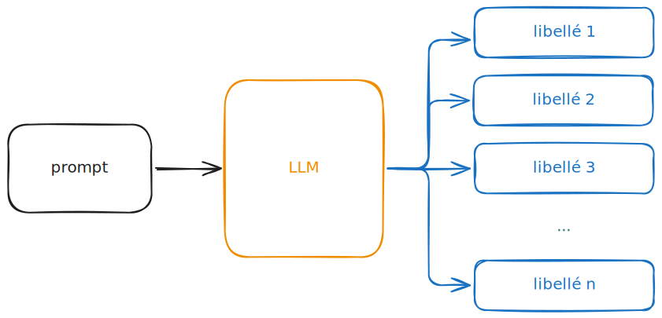

# 1️⃣ Contexte
La codification automatique de libellés

## Text2Code

[**Objectif initial**]{.orange} **: codifier des libellés dans une nomenclature**.

. . .

* NAF/NACE, COICOP, ...
* La nomenclature peut être très vaste (plusieurs centaines de codes différents).

. . .

On détient une **notice associée** à la nomenclature :

* La notice est exhaustive ;
* Elle contient souvent les champs `code`, `titre`, `includes`, `excludes`.

. . .

On détient parfois déjà des paires libellés/code issues de données réelles.

## La codification automatique n'est pas évidente

Plusieurs [**difficultés majeures**]{.orange} à l'apprentissage :

:::{.incremental}
* **Défaut de couverture** des données d'entraînement ;
* **Actualisation** possible de la nomenclature ;
* **Bruit sémantique** : fautes d'orthographe, infos personnelles, typos, ... 
* **Bruit d'annotation** : mauvais code pour le libellé ;
* **Possible manque de données** : passage à l'anglais, nouvelle nomenclature, ...
:::

. . .

→ **Sans génération de données synthétiques,** [**la codification automatique peut être imprécise, voire impossible**]{.orange}.  

# 2️⃣ La génération de données synthétiques

## Le cas particulier de notre contexte

La **génération de données habituelle** repose sur la donnée entrante uniquement :

:::{.incremental}
* **Sans LLM** : reproduire une distribution avec des garde-fous ; 
* **Avec LLM** : donner le plus de contexte et des exemples few-shot ;
* La donnée générée n'apporte [**pas d'innovation**]{.orange} à la donnée d'entraînement.
:::

. . .

Dans notre cas, on détient une **notice** pour la nomenclature :

:::{.incremental}
* [**Information supplémentaire exhaustive**]{.orange} ;
* **Adaptée pour les LLM** : on fournit des éléments de la notice en contexte.
:::

## Objectifs recherchés

[**Objectifs généraux**]{.orange} pour la génération de donnée :

. . .

* **Augmenter/diversifier/générer la donnée d'entraînement** des classifieurs ;
* Pouvoir **partager la donnée** sans fuite du dataset original, tout en rendant compte de son format, de sa distribution, et de la sémantique des libellés ;
* Créer des scripts de génération **agnostiques de la nomenclature**.

. . .

[**Les objectifs ne convergent pas forcément**]{.orange} **autour d'un unique outil :**

. . .

* Améliorer les performances d'un classifieur par la donnée, c'est rarement reproduire la distribution originale ;
* Risque de **se rapprocher de données bruitées** indésirables.

## Evaluation de la génération

[**Axes majeurs**]{.orange} **à explorer :**

:::{.incremental}
* **Performances du classifieur** selon la construction du jeu d'entraînement (données synthétiques plus ou moins présentes) ; 
* **Diversité de la génération** : utilisation de scores d'embeddings (DCScore, IMMD, ...), ou des rapprochements sémantiques (Jaccard Similarity, Self-BLEU, ...) ;
* **Viser la distribution sémantique originale** : soit avec les mêmes méthodes que pour la diversité, soit avec l'utilisation d'un discriminateur IA/humain. 
:::

. . .

On recherche de **bonnes performances dans ces trois domaines indépendamment du code** derrière les libellés générés.

# 3️⃣ Naive Code2Text
Génération augmentée par la notice

## Principe général de Naive Code2Text

{fig-alt="Naive Code2Text" fig-align="center"}

## Passage à l'échelle : parallélisation

On prend le schéma précédent, et on l'adapte pour lancer des requêtes API en parallèle :

\

{fig-alt="Naive Code2Text with parallel configuration" fig-align="center"}

## Premiers résultats

**Points positifs** :

:::{.incremental}
* La génération est **très fidèle** à la notice ;
* **Grande diversité** dans les thématiques (grâce à la diversité dans la notice) ;
* Génération **plutôt rapide** (environ 100 000 libellés/heure).
:::

. . .

**Point négatif majeur** : [**la donnée est "trop parfaite"**]{.orange}

:::{.incremental}
* Ton professionnel ;
* Syntaxe et grammaire irréprochables ;
* Vocabulaire proche de la notice.
:::

. . .

**→** [**Données peu exploitables**]{.orange}

# 4️⃣ Code2ReText
Ajouter un niveau de profondeur

## LabelGuard : Discrimination des libellés

[**Entraînement**]{.orange} d'un discriminateur IA/humain sur les embeddings des libellés (dim = 4096) :

:::{.incremental}
* **Benchmarking** de plusieurs modèles via MLFlow ;
* **Grid Search** rapide sur les hyperparamètres ;
* Choix du modèle avec le **meilleur FPR** (val).
:::

. . .

**Résultat** : [**MLP (4096 → 1024 → 256 → 1) avec dropout initial**]{.orange} (0.3)

:::{.incremental}
* FPR : 0.69 %
* Accuracy : 99.4 %
:::

. . .

**→ Déploiement sur une API :** [https://labelguard.lab.sspcloud.fr/](https://labelguard.lab.sspcloud.fr/)

## Rappel : Naive Code2Text

{fig-alt="Naive Code2Text - agent version" fig-align="center"}

## Code2Retext : discriminateur in the loop

{fig-alt="Code2ReText - loop" fig-align="center"}

## Autre structure possible (version agentic)

{fig-alt="Code2ReText - agentic" fig-align="center"}

# 5️⃣ Perspectives

## Travail futur

**Améliorer Code2ReText**

:::{.incremental}
* Prendre en compte systématiquement LabelGuard ;
* Eviter les **hallucinations** ou autres dérives (recopier le même libellé, tromper le discriminateur, ...).
:::

. . . 

**Passer au Supervised Fine Tuning** (SFT)

:::{.incremental}
* Idée : mimer la distribution sémantique originale ;
* Grand enjeu de stabilité au cours des itérations ;
* Passer à un paradigme tourné **RLHF si inefficace**.
:::

## Parvenir à un outil exploitable et performant

**[Evaluer]{.orange} précisément les générateurs** (benchmark final)

:::{.incremental}
* **Performances du classifieur** avec la donnée synthétique ;
* Comparer **diversité** intrinsèque // **similarité** avec la donnée originale.
:::

. . .

**[Mettre en production]{.orange} le générateur performant**

:::{.incremental}
* **API pour la NAF** ;
* *Déployer pour la NACE en traduisant ?*
* Code pour les autres nomenclatures.
:::

## Planning

{fig-alt="Planning du stage" fig-align="center"}
